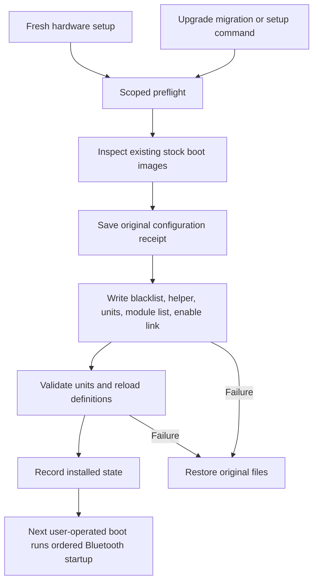

# Bluetooth startup installer

Fresh hardware setup and the upgrade migration now install the qualified Bluetooth startup sequence for Apple MacBookAir9,1 with T2 and BCM4377b at the validated PCI address. Setup is automatic only for this hardware scope. Other models are skipped. The gate waits for brcmfmac's registered Wi-Fi interface and PHY, then loads HCI before BlueZ and user sessions. It does not require a Wi-Fi connection or enable either radio.

## Entry points

- Fresh target: `hardware/all.sh` runs `apple/fix-t2-bluetooth.sh` after `fix-t2.sh` creates the initial module list. The latter now preserves existing module configuration instead of reintroducing early HCI loading on repeat runs.
- Existing install: migration `1789070892.sh` checks hardware and calls `omarchy setup t2-bluetooth`. A failed migration propagates failure and remains pending.
- Explicit setup: `omarchy setup t2-bluetooth`; inspect ownership with `--verify`; restore the previous startup configuration with `--rollback`.

All paths use `install/hardware/apple/t2-bluetooth/manage.py`. The installer enables the gate by creating its owned target link but does not start it, restart BlueZ, unload modules, rebuild boot images, change radio preferences, or initiate a power transition. Startup ordering takes effect on the next user-operated boot.

## Files and ownership

The transaction owns the gate at `/usr/local/sbin/bluetooth-after-wifi`, `bluetooth-after-wifi.service`, its multi-user.target enable link, the BlueZ ordering drop-in, the scoped HCI blacklist, and the reduced `/etc/modules-load.d/t2.conf`. Runtime source is distributed under `install/hardware/apple/t2-bluetooth/` and copied by the installer, with a receipt covering the exact bytes and modes. The copied helper is intentionally independent of an interactive user's environment.

The receipt at `/var/lib/omarchy-t2-bluetooth/receipt.json` records original and installed content, modes and link targets. Files are atomically replaced individually, with a preparing receipt saved before mutations. The group of filesystem changes is not a single crash-atomic transaction. Caught failures restore the original set. After interruption, a pending receipt stops repeat installation; `--rollback` restores files only if each still matches its recorded original or installed value. Administrator edits stop rollback before any file changes. A second disk error during restoration requires manual recovery from the receipt.

A repeat installation verifies exact owned content and checks for newly conflicting policy. A different future payload is deliberately refused pending a reviewed upgrade; it cannot silently rewrite this installation's saved rollback baseline. After explicit rollback, another install requires review of the retained receipt rather than automatically discarding history.

The known revision-2 experimental helper, unit and configuration can be adopted in place if their content matches. Rollback restores that exact earlier arrangement. The old experiment's receipts are left intact but superseded while this installer owns the files; do not run its older rollback manager concurrently. Custom gate drop-ins, including the isolated MPC candidate wrapper on the development machine, cause a preflight refusal. They must be retired through their owning experiment before adopting the service; the validated development-machine handoff subsequently removed that candidate through its owning manager before adopting this installer.

## Boot and policy checks

Before changing configuration, setup rejects unknown module lists, file or parent symlinks, custom/masked Bluetooth units, service overrides, and other explicit HCI module requests in the checked modules-load, modprobe and mkinitcpio configuration directories. Known stock T2 UKIs and initramfs images are inspected with `lsinitcpio`; an HCI module in one or an inspection error stops installation. Existing-install setup also refuses an unrecognized boot layout with no stock T2 image. Fresh target setup permits an image not yet generated, while still checking any existing stock images and explicit configuration. A freshly generated image and first boot still need validation in the installer environment.

The gate retains the qualified readiness algorithm and model/device guard, but removes the exact `uname` release pin: leaving that pin behind would make the installed blacklist suppress Bluetooth after a routine kernel upgrade. Registration capability, timeout and explicit modprobe success still govern startup. This does not claim that future kernels or other models have been tested. Gate failure leaves Bluetooth unavailable but bounds login delay; it never silently forces the old early-load sequence or changes radio preferences.

## Validation

Seventeen isolated tests cover fresh installation, idempotence, known revision adoption, rollback, interrupted transactions, seven injected write failures, unit-validation failure, custom configurations, parent symlinks, new overrides on repeat setup, masked BlueZ, boot-image rejection/errors and model scope. Shell tests cover installer/setup/migration routing, unsupported-machine no-op, and failure propagation. CLI metadata and Bash/Python syntax checks passed. Systemd unit analysis passed with harmless sandbox socket-option warnings; it did not start services.

The packaged gate's readiness logic differs from the qualified source only by removing the release pin and indentation. The original six gate fixture tests and existing T2 touchpad, sleep and Wi-Fi suites are retained. Prior hardware evidence remains documented in the consolidated audit. This installer was subsequently deployed on the validated MacBookAir9,1 and passed its normal fresh-boot acceptance check. The user confirmed the requested Bluetooth icon, toggle and AirPods reconnect/audio checks; the journal independently verified startup ordering. Fresh ISO installation remains untested. See [the hardware validation record](t2-validation.md).

