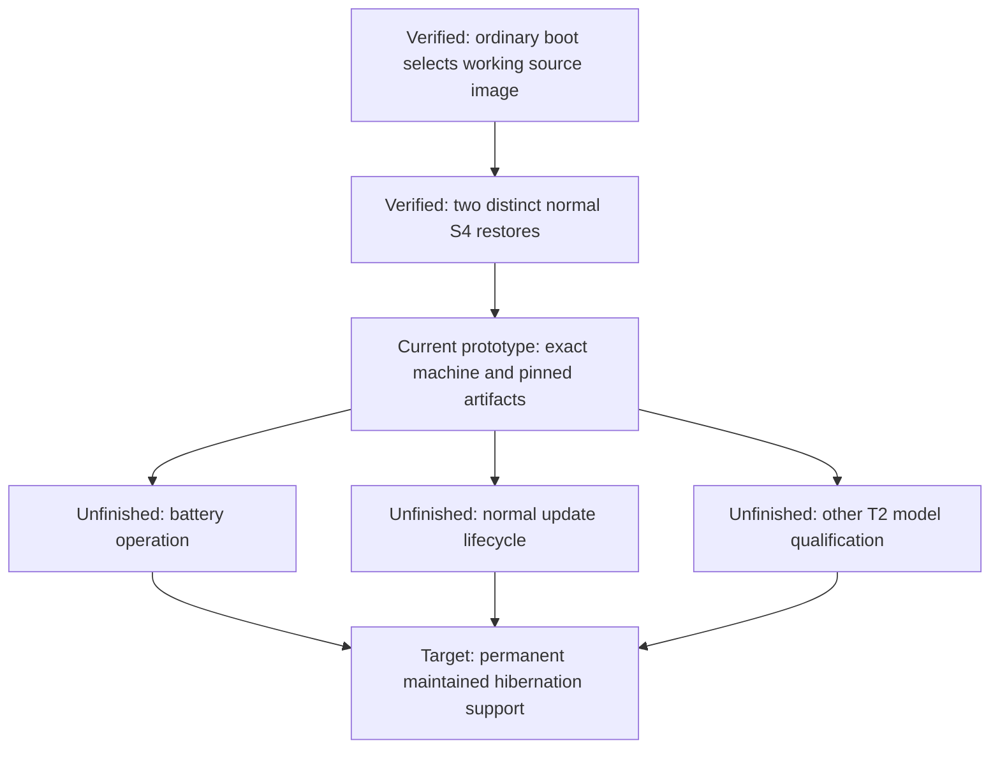

# T2 hibernation: start here

Status as of 2026-09-30: **ACTIVE as an opt-in product on the MacBookAir9,1 on linux-t2 7.2.7 (generation `f4025add13d1`); single model, private image pair, upstreaming not started**. The map of all documents is [README.md](README.md), the plain-language explanation is [HIBERNATION-OVERVIEW.md](HIBERNATION-OVERVIEW.md) and the 7.2.7 hardware record is [EVIDENCE-7.2.7.md](EVIDENCE-7.2.7.md). The rest of this page is the evidence register and agent contract as of the 2026-09-27 prototype; sections that describe the AC-only gate, the blanket package block or a prototype-only status are historical and are corrected in place where noted.

We have demonstrated real S4 power-off and restoration of the original Linux session through two AC-powered normal desktop/logind cycles, with an ordinary boot into the working source image between them, and one later attended battery-only cycle. Battery-aware runtime `e489bab7` returned the original session on battery with the same boot ID and reconciled the cycle without failed units. This is meaningful local hardware evidence, not a permanent fix: the provisional 30% reserve guard is not a measured low-battery policy, the prototype still blocks package transactions, and no other T2 model is qualified. The earlier declaration that the goal was complete was incorrect.

The target is normal, persistent hibernation on battery as well as AC, maintained safely through ordinary updates, with an explicit path to support other T2 Macs. Do not redefine that target around the prototype's restrictions.

## Reading map

| Question | Document | Purpose |
| --- | --- | --- |
| What works, what does not, and where do I start? | [README.md](README.md), then [Overview](HIBERNATION-OVERVIEW.md) | Entry point and plain-language explanation |
| What happened on the hardware on 7.2.7? | [7.2.7 evidence](EVIDENCE-7.2.7.md) | Gate-by-gate hardware record |
| How do I requalify after a kernel update? | [Requalification](REQUALIFICATION.md) | Attended operator procedure |
| Evidence register for the 7.2.6 prototype | This guide | Evidence index and agent contract |
| What failed, and what changes made restoration work? | [Mechanism and failure chain](HIBERNATION-MECHANISM.md) | Source-linked explanation, diagrams, and limits of causal claims |
| How do we make this permanent and portable? | [Production and portability plan](HIBERNATION-PRODUCTION-PLAN.md) | Battery support, update lifecycle, model boundaries, and acceptance criteria |
| What happened in a particular experiment? | [Investigation journal](HIBERNATION.md) | Historical checkpoints, hashes, failures, and successful cycles |
| How did the separate S3/radio work develop? | [Suspend overview](README.md) | Driver background; S3 success is not S4 proof |
| Where is the runtime code? | [Hibernation implementation](../../packages/t2-suspend/hibernate/README.md) | Component-level interfaces and source |

Read the guide, then mechanism, then production plan. Use the journal to verify a specific claim, not as a linear tutorial: older entries intentionally describe states that later work superseded.

## The gap between a successful experiment and a permanent fix

Text equivalent: successful boot selection, two AC returns and one attended battery-only return establish the prototype. Production-ready battery behavior, safe normal updates, and model-specific qualification are remaining work; a new successful experiment does not silently complete them. This is a status diagram, not an implemented production architecture. Each edge means “contributes evidence or work toward,” not hardware causation.

## What “hibernate” must mean here

S3 suspend retains RAM while much of the machine sleeps. S4 hibernation writes a memory image to persistent storage, powers down, and later restores that image. The second kernel used to read the image must hand execution back to the saved original kernel/session. A normal new boot, visible lock screen, successful image read, or controlled diagnostic abort is not that result.

The current implementation distinguishes two roles:

- **Source image:** boots the session that will be saved and resumed.
- **Restore image:** cold-boots, prepares the restore environment, reads the saved image, and hands back to the original session.

Both private images retain the production Linux kernel and command line byte-for-byte. Their role-specific initramfs contents and restore handling differ. This design avoided repeating replacement-kernel images that failed to mount the real encrypted root even after offline/VM checks. Whether the final maintained solution should retain both images is an open design question, not a permanent requirement imposed by this guide.

## What the two inconvenient restrictions actually are

### The earlier AC-only gate was a software rule, not a T2 hardware requirement

The previous installed routine path and legacy v1 configuration rejected a machine without an online mains supply in [`product.py`, `_admission_state`](../../packages/t2-suspend/hibernate/product.py). Runtime `e489bab7` and explicit v2 battery policy are now installed, with native reserve checks before allocation and again immediately before writing the image; one attended battery-only S4 has now restored and reconciled. The current threshold is 30% of measured charge/full reserve, an explicitly provisional engineering policy, not the firmware's displayed percentage or measured endurance assurance. See the [implementation and provisional limits](HIBERNATION-PRODUCTION-PLAN.md#source-implementation-for-attended-battery-qualification). The historical trial retains its own AC rule in [`trial.py`](../../packages/t2-suspend/hibernate/trial.py).

The two earlier normal cycles ran with AC connected; the later [battery-only result](HIBERNATION.md#first-attended-battery-only-s4-restored-the-original-session) demonstrates one actual write, power-off, wake, restore and original-process reconciliation without AC. It does not validate low-reserve refusal, power-source transitions or unattended recovery. The permanent policy still needs measured reserve and recovery limits rather than a one-cycle extrapolation.

### The package block protects a pinned prototype, not a usable final update design

The installed [ALPM hook](../../packages/t2-suspend/hibernate/00-omarchy-t2-hibernate-guard.hook) runs [the update guard](../../packages/t2-suspend/hibernate/update_guard.py) before **every package install, upgrade or removal**. It refuses while the routine opt-in, source-default policy or incomplete transition is present. It is broader than just kernel upgrades.

Why it exists: an update can change the production kernel, modules, firmware, initramfs or boot configuration while the default still points to an older private source image. Rejecting hibernation after the update would not protect that next ordinary boot. The temporary solution freezes package transactions while the reviewed pair is active. “Safe deactivation” means verifying restoration of the stock boot default and disabling the prototype route before allowing updates—not deleting the hook or assuming any new image is compatible.

`omarchy update` now handles the pause for the user: it asks before pausing hibernation, runs the reviewed `maintenance` action, and after the update runs the read-only `assess` and offers to turn hibernation back on only when nothing qualified changed (otherwise it says hibernation stays off until requalified and suspend still works). See [the maintenance runbook](MAINTENANCE-RUNBOOK.md#normal-path-omarchy-update-does-this-for-you).

After a kernel update the pair still has to be requalified, which is the maintained lifecycle ([REQUALIFICATION.md](REQUALIFICATION.md)); the true fix is upstream drivers ([overview](HIBERNATION-OVERVIEW.md#path-to-upstream)). The [production plan](HIBERNATION-PRODUCTION-PLAN.md) holds the remaining requirements. Neither guard is removed by documentation.

## Evidence register

These are historical measurements, not commands or permission to replay a vector. The full records remain in the journal and the machine's private evidence store; this repository does not contain unlock keys or private boot images.

| ID | Claim established | Evidence anchor | What it does not establish |
| --- | --- | --- | --- |
| E01 | First full cold S4 restoration reached the original source process | [First v16 return](HIBERNATION.md#first-v16-full-restoration-return), vector `33a2e46e7598c0737daf3eb294ea50088bc60bf526d8cdd163561cd10e447365` | Routine desktop integration or family-wide support |
| E02 | First normal-logind S4 cycle restored and reconciled without manual repair | [Normal-logind result](HIBERNATION.md#first-normal-logind-s4-cycle-succeeded-without-repair), cycle `064742e3-c4bd-4a5b-b00d-d69590d01837` | Battery or update support |
| E03 | The persistent source default selected the expected existing source image and passed full admission | [Ordinary source boot](HIBERNATION.md#ordinary-source-default-boot-verified), boot `0f909934-0ecf-4407-863d-6822c81cb2df` | A hibernation restore by itself |
| E04 | A distinct subsequent normal cycle restored the original E03 session and automatically cleaned up | [Repeat S4 result](HIBERNATION.md#repeat-normal-s4-succeeded-after-ordinary-source-default-boot), cycle `12f886c4-fecb-41ef-ad12-31374e63677d` | Long-term reliability, other kernels, or other T2 models |
| E05 | First attended battery-only S4 returned the original session on unchanged boot and reconciled without failed units | [Battery-only result](HIBERNATION.md#first-attended-battery-only-s4-restored-the-original-session), cycle `0b8fa4cf-7055-45a5-aa9f-99538a02564e` | Measured low-battery safety, update compatibility, unattended recovery or other T2 models |

E04 includes kernel S4 entry/wake/exit, return of the original service process, eight archived evidence members with verified hashes, terminal retirement/reconciliation, and healthy user slice, Wi-Fi and Bluetooth. The operator also returned to the session. Generic mechanical witness flags and historical qualification records must not be edited to manufacture broader qualification.

The runtime used for E04 is the 209-file snapshot of commit `608464ddbeba75046c3173ad773b30608ab904a9`. Later documentation commits do not change that installed snapshot. Exact hashes, raw-file versus canonical-record digest distinctions, and local archive locations belong in the linked journal, not in copied ad hoc qualification files.

## How the T2 platform research helps

The external [T2 platform research](https://github.com/macintog/t2-platform-research) is an important source of subsystem boundaries and testable hypotheses, not a ready-made proof that this patch works on every T2. The local research snapshot used here is commit `423d2b056b69764876097818b3efc74319a7f944`.

| Research entry | Useful question | Boundary to preserve |
| --- | --- | --- |
| [Sleep, wake and hibernate](https://github.com/macintog/t2-platform-research/blob/423d2b056b69764876097818b3efc74319a7f944/docs/power/sleep-wake-and-hibernate.md) | Which retained state, queue and cold-boot assumptions differ across transitions? | Ordinary BCE save/restore and RTBuddy cold-boot-after-hibernate policy are different mechanisms |
| [PCI services and DMA](https://github.com/macintog/t2-platform-research/blob/423d2b056b69764876097818b3efc74319a7f944/docs/platform/pci-services-and-dma.md) | Which reset scope affects BCE alone versus storage, SEP and audio on the shared link? | A successful local function operation does not qualify a shared-link reset |
| [Board configurations](https://github.com/macintog/t2-platform-research/blob/423d2b056b69764876097818b3efc74319a7f944/docs/platform/board-configurations.md) | Which firmware topology and policy need comparing before a port? | Shared T2 topology does not prove identical host ACPI, peripherals or working hibernation |

For example, the board matrix maps MacBookAir9,1 to `J230kAP` and MacBookPro16,1 to `J152fAP`. Much of the research's host observation concerns the latter; our successful cycles concern the former. Keep those evidence scopes separate. Firmware `min-sleep-state` values are not ACPI S-state numbers.

## Agent entry contract

1. Treat the current status as **ACTIVE on the MacBookAir9,1 on 7.2.7, not a permanent upstream fix**. The 7.2.6 evidence register below and the 7.2.7 record do not establish measured low-battery safety, long-term reliability, stock-kernel hibernation or another model's qualification.
2. Read the mechanism and production plan, then inspect the actual source and evidence for the requirement being changed. Use the journal's named checkpoint rather than assuming every older “next” paragraph is current.
3. Before touching hardware, reconcile `/home/jjc/.local/state/codex-mba-autonomous/handoff.json`, current boot ID, selected image, repository checkpoint, installed runtime and the ledger's actual terminal cycle. Local paths are references for this development laptop, not paths to ship in a general installer.
4. Keep physical boot, EFI, module loading and power transitions serialized under the orchestrator. Documentation and design work do not authorize new physical tests. Preserve failed/consumed vectors and guards; do not replay them under new labels.
5. Preserve the production `.linux`/`.cmdline` invariant and rejected-image rules in [AGENTS.md](../../AGENTS.md). A VM pass cannot qualify a replacement kernel on the physical encrypted root.
6. Record a change as **implemented**, a measurement as **observed**, a supported result as **verified**, and an explanation without decisive evidence as **hypothesis**. Mark future designs **proposed** and missing evidence **unvalidated**.
7. Do not expose private initramfs contents, unlock material, firmware dumps or local secret configuration in documentation or external diagram renderers. Commit diagram source and references, not machine secrets.
8. Do not mark the goal complete until the [production acceptance checklist](HIBERNATION-PRODUCTION-PLAN.md) is satisfied. Keep successful historical evidence intact while correcting mistaken completion claims.

## Maintaining these documents

The Markdown/Mermaid source is the diagram source of truth; adjacent prose is the fallback for agents, terminals and Markdown viewers without Mermaid support. Diagrams are schematic and not to scale. Use one question per figure, top-to-bottom flow where practical, explicit labels rather than color-only meaning, and source links beside technical claims. Update code references and evidence status when behavior changes; preserve the historical journal instead of silently rewriting past outcomes.
