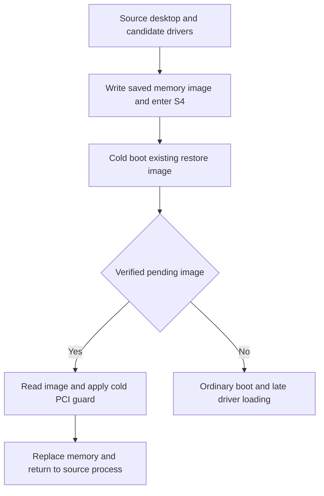
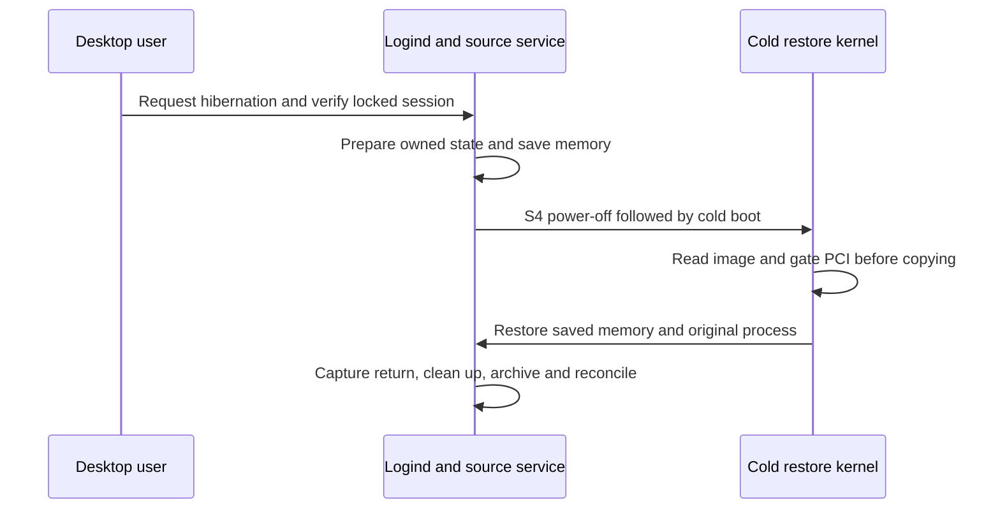

# How the current T2 hibernation prototype works

This explains the observed failures and the working experimental path on this MacBookAir9,1. Two AC-powered normal-logind S4 cycles and one attended battery-only cycle returned successfully; the second AC cycle followed an ordinary source-default reboot. That is evidence for the exact tested machine and image pair, not a permanent hibernation fix: measured low-reserve behavior, normal package-update compatibility, other T2 models and long-term reliability remain unfinished. The detailed observations and immutable attempt identities are in the [investigation record](HIBERNATION.md#first-attended-battery-only-s4-restored-the-original-session).

## Why suspend fixes were insufficient

S3 suspend keeps a running system's memory available; S4 hibernation saves memory to disk and later replaces the cold boot kernel's memory with that saved image. Linux memory can therefore return to an older state while peripheral firmware, DMA queues and PCI configuration belong to a different lifecycle. A driver that recovers ordinary suspend need not recover this memory rewind or the firmware state after a cold start.

The investigation found several distinct failures. Broadcom Wi-Fi lacked hibernation callback pairing: image readback succeeded, but the second freeze found its bus down. Pairing callbacks crossed that boundary, yet restored packet identifiers and rings still desynchronized. BCE virtual USB then resumed with stale submissions and command timeouts, losing the internal keyboard and trackpad. The BCE parent had ordinary suspend/resume callbacks without the hibernation callbacks needed to coordinate its firmware handshake with its children. Audio had a similar callback gap. These observations and changes are recorded in the [callback investigation](HIBERNATION.md) and the actual [BCE callback patch](../../packages/t2-suspend/patches/bce/0001-t2bce-run-stateful-handshake-for-image-restore.patch), [audio callback patch](../../packages/t2-suspend/patches/bce/0002-t2bce-audio-pair-hibernation-callbacks.patch) and [Wi-Fi callback patch](../../packages/t2-suspend/patches/wifi/0006-brcmfmac-complete-hibernation-pm-callbacks.patch).

The resulting device freeze/thaw tests established particular callback and ordering improvements; they did not establish cold S4 restoration. A restore-time Wi-Fi function reset caused a separate failed vector and was rejected. Earlier successful S3 work on Wi-Fi and Bluetooth likewise does not prove S4 support. The [driver package reference](../../packages/t2-suspend/README.md) distinguishes these scopes.

The candidate source stack goes beyond callback pairing. It drops and rebuilds BCE command and client queue graphs for the no-state hibernation path, with a cold-only firmware reconstruction fallback; ordinary S3 and hibernation unwind retain separate contracts. See the [queue reconstruction patch](../../packages/t2-suspend/experiments/0006-t2bce-rebuild-queues-for-hibernation.patch). Source-stack changes and cold-restore changes form a combined tested configuration; the successful return does not isolate one change as the universal cause or cure.

## Why there are two images

The source image boots the normal desktop with the candidate T2 driver stack. The restore image initially loads encrypted-root storage dependencies while keeping BCE and radio candidate drivers out of the pre-restore module tree. This avoids constructing a new peripheral queue graph before applying an older memory image. On an ordinary boot without a pending image, its late payload loads the candidate drivers after switching to the real root. On a successful pending resume, control transfers into the saved source kernel before that late payload runs.

Both private UKIs preserve the actual production `.linux` and `.cmdline` bytes. Their initramfs contents and boot roles differ. Replacement kernels previously failed to mount physical encrypted root even when offline checks passed, so replacement-kernel experimentation is excluded from the current boot design. The probes and PCI guard are external modules built against the production kernel; they are not replacement kernels. The source/restore split and artifact evidence are recorded in the [investigation](HIBERNATION.md), and the [full-restore runtime](../../packages/t2-suspend/experiments/hibernate-cold-pci-restore/README.md) specifies the pending path.

In words: the source desktop saves its memory and powers off. A cold restore boot verifies a pending image, reads it, gates the shared PCI functions and transfers into the original source process. A boot without a pending image follows ordinary boot and late driver loading instead. The diagram is a schematic of the tested design, not a measured timing trace.

## The cold PCI guard: what it actually changes

The isolated cold restore kernel has no candidate BCE driver to run that driver's shared-function bus-master gate. Source-level reproductions showed that generic PCI freeze can leave firmware-enabled bus mastering intact when Linux's enable count is zero. This is a demonstrated coverage gap. It does not prove that DMA caused any particular reset or corrupted any image.

The [guard source](../../packages/t2-suspend/experiments/hibernate-cold-pci-guard/mba_hibernate_cold_pci_guard.c) binds only the otherwise-unbound BCE function. It checks four Apple functions in the same PCI slot: function 0 ANS storage (`106b:2005`), function 1 BCE (`106b:1801`), function 2 SEP (`106b:1802`) and function 3 audio (`106b:1803`). ANS must remain owned by `nvme`, with its actual `0x018002` class; SEP and audio must be unbound. Probe temporarily disables asynchronous PM on all four functions and remembers the prior policy for removal. It neither resets ANS nor initializes BCE queues.

Its one-use gate runs in `.freeze_noirq`, after image readback and ordinary main quiesce callbacks, before architecture memory replacement. It first requires no Linux ANS enable references, an already-clear ANS `PCI_COMMAND_MASTER` bit, and readable controller status proving either reset-disabled ANS or completed normal shutdown. Completed shutdown is accepted because the pinned NVMe shutdown path can leave CC.EN set while CSTS.SHST reports completion. Inaccessible all-ones reads and ambiguous states refuse the gate.

The guard records the original MASTER bits of all four functions, clears and checks those bits, saves disabled PCI configuration, and explicitly masks MASTER from each saved COMMAND dword even after a partial clear/save error. It changes bus-master permission, not the entire PCI COMMAND value or firmware translation tables. Scrubbing the saved configuration matters because generic PCI thaw-noirq restores that snapshot before invoking the driver's callback.

On an abort/recovery path, `.thaw_noirq` checks that mastering remains blocked. It does not reopen DMA there. Only `.complete`, after all ordinary main recovery callbacks, restores bits recorded as previously enabled; it preserves any new ANS mastering enabled by storage recovery for fresh queues. Recovery errors remain latched. On successful atomic memory replacement, the restore kernel and its guard disappear; the saved source kernel and its own driver recovery path resume. The [guard explanation and fault coverage](../../packages/t2-suspend/experiments/hibernate-cold-pci-guard/README.md) document this distinction.

This is an Intel host PCI guard, not an arm64 DART driver. T2 bridgeOS uses its own shared DART translation and PCIe lifecycle; host Intel IOMMU state is a different layer. The [commit-pinned platform research](https://github.com/macintog/t2-platform-research/blob/423d2b056b69764876097818b3efc74319a7f944/docs/platform/pci-services-and-dma.md) explains that boundary. Clearing MASTER does not establish that posted DMA drained, firmware remained quiescent, or DART was reconstructed. No shared PERST or ANS reset is inferred from this guard.

## Evidence separates diagnostic recovery from restoration

Controlled-abort modules deliberately stopped at selected boundaries and let the kernel recover. The combined PCI/pre-architecture experiment established a consumed guard gate and recovery at `swsusp_arch_resume()` entry; it stopped before the architecture restore body and atomic copying. Its positive witness means the intended diagnostic worked. It means neither successful hibernation nor a failed attempt at full restoration. See the [combined experiment](../../packages/t2-suspend/experiments/hibernate-cold-pci-pre-arch/README.md).

The v16 full-restore profile removed the abort module and kept the corrected guard. Its synchronous initramfs resume hook requires exact pending swap/EFI evidence and module identities. Every return to that pending restore initramfs enters recovery, even if the resume command returned zero; successful transfer must return through the original source execution instead. Source stage 4 and restore stage 7 markers bound progress, but stage 7 is entry to late/noirq quiesce, not proof that copying completed. The original process, original boot identity, restored runtime, exclusive return witness and health evidence establish the first [v16 source return](HIBERNATION.md#first-v16-full-restoration-return), conditional on the trusted collector.

In words: the user request passes through logind and a locked-session check. The source service prepares tracked state and saves memory. After S4 and cold boot, the restore kernel reads the image and gates PCI before copying. The original source process then captures the return, reverses owned preparation and reconciles its durable evidence. This figure shows the successful lifecycle; a controlled abort follows recovery in the restore kernel instead of the return arrow.

Two later normal-logind cycles, `064742e3-c4bd-4a5b-b00d-d69590d01837` and `12f886c4-fecb-41ef-ad12-31374e63677d`, completed that desktop lifecycle without manual repair. The second followed an ordinary source-default reboot and restored original boot `0f909934-0ecf-4407-863d-6822c81cb2df`. Independent return audits checked archive members, retirement/reconciliation and clean post-return state. These local successes support this exact path; they do not identify a universal T2 failure mechanism.

## Desktop and evidence integration are separate layers

The [preparation adapter](../../packages/t2-suspend/hibernate/preparation.py) tracks bolt, Bluetooth, owned Wi-Fi detach, PM settings, a consumed attempt guard, source marker and restore one-shot. Cleanup reverses owned changes; separate retirement removes only validated reusable EFI stages after archiving their evidence. Consumed vectors and original receipts remain preserved. This bookkeeping avoids treating a stale marker or a later ordinary boot as a successful return.

The normal route uses logind and the vendor hibernation-service lifecycle, with the [fixed sleep entry](../../packages/t2-suspend/hibernate/sleep_entry.py), [secure-session validation](../../packages/t2-suspend/hibernate/secure_session.py) and [owned desktop freeze/thaw](../../packages/t2-suspend/hibernate/desktop_sleep.py). Lock verification precedes preparation and is rechecked before power. These changes address desktop admission and integration, not proof of a hardware failure cause.

An earlier genuine return encountered a separate archive failure on Btrfs: a directory descriptor opened before files were created produced a stale empty listing. The [archive implementation](../../packages/t2-suspend/hibernate/evidence_archive.py) now opens a fresh `.` descriptor relative to the retained directory, verifies device/inode identity and enumerates that view. That fixes evidence publication after return; it does not explain the preceding hardware restoration failures.

## What remains before permanent support

Installed runtime `e489bab7` permits attended battery operation with an explicit provisional 30% native-reserve threshold and fresh admission/pre-write checks; legacy v1 configuration remains AC-only. Battery-only cycle `0b8fa4cf-7055-45a5-aa9f-99538a02564e` restored the original session with AC offline before and after, and the operator confirmed usable return. This establishes one battery success, not a measured low-reserve limit or power-loss resilience. The [update guard](../../packages/t2-suspend/hibernate/update_guard.py) still intentionally blocks every package transaction while routine opt-in, active policy or unresolved transition state is present. Reviewed [native deactivation](../../packages/t2-suspend/hibernate/boot_policy_native.py) restores stock boot before updates. The source-only maintenance coordinator is not deployed and does not relax that live restriction. These measures protect pinned images but do not yet provide normal update-compatible hibernation.

Permanent support therefore still needs battery policy and validation, a reviewed update/restaging/requalification lifecycle, interruption recovery and broader repeat/peripheral evidence. Other T2 models need their own hardware identities and lifecycle validation; the guard currently explicitly matches MacBookAir9,1. The research distinguishes ordinary stateful BCE sleep from RTBuddy cold-boot-after-hibernate and does not recover a complete universal S4 sequence: see its [commit-pinned sleep analysis](https://github.com/macintog/t2-platform-research/blob/423d2b056b69764876097818b3efc74319a7f944/docs/power/sleep-wake-and-hibernate.md). Firmware/host research comparators are context, not qualification of this MacBook or other models. This document introduces no new hardware test or authorization.

## Glossary

- **UKI:** Unified Kernel Image, containing the kernel, command line and initramfs used by a boot entry.
- **Initramfs:** Early boot environment that unlocks storage and initiates resume before normal userspace.
- **BCE / VHCI:** T2 Buffer Copy Engine transport and its virtual USB host controller, including internal input devices.
- **ANS / SEP:** T2 host storage controller and Secure Enclave transport PCI functions.
- **DMA / MASTER:** Device memory access and the PCI bus-master permission bit gated here.
- **DART:** T2 firmware's address-translation layer, distinct from the Intel host IOMMU.
- **Freeze / thaw / restore:** Different Linux PM phases; thaw recovers from image creation or an aborted operation, while restore resumes the saved image's devices.
- **Vector / consumed guard:** An exact attempt identity and durable evidence preventing an unchanged hardware attempt from being replayed.
