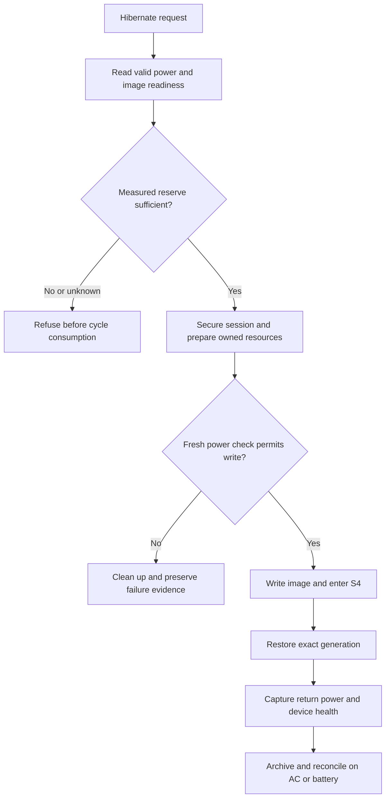
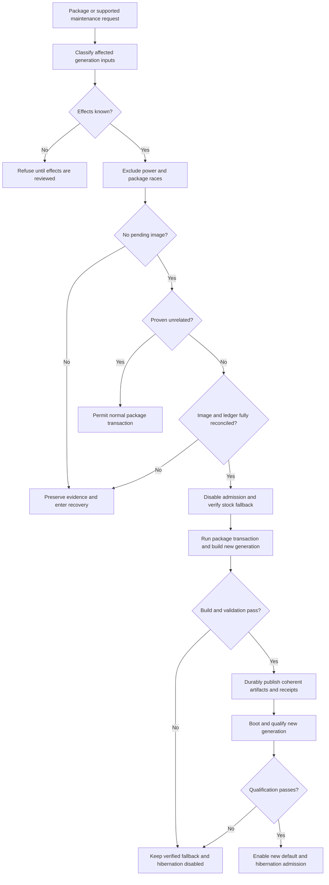

# T2 hibernation production plan

Status: **GOAL NOT DONE**. The goal is permanent hibernation on battery, ordinary safe updates, and a maintainable route to other T2 models. This document is a proposed implementation and evidence plan, not deployed functionality or permission for a hardware transition.

## What the prototype proves

MacBookAir9,1 has completed normal-logind S4 cycles `064742e3-c4bd-4a5b-b00d-d69590d01837` and `12f886c4-fecb-41ef-ad12-31374e63677d`. The latter followed an ordinary boot through the activated source default and returned to original boot `0f909934-0ecf-4407-863d-6822c81cb2df`; the original vendor-service process completed archive, cleanup, slot retirement and reconciliation. The operator returned to a usable desktop. See [actual evidence and historical limits](HIBERNATION.md).

This establishes an attended, AC-powered prototype on the exact source/v16 restore pair and reviewed runtime `608464dd`. It does not establish battery operation, normal update compatibility, unattended recovery, broad T2 support or long-term reliability. Historical qualification flags and consumed guards remain unchanged; successful return is not authority to replay a consumed vector.

## Current guardrails and actual constraints

| Current condition | Meaning | Required production work |
| --- | --- | --- |
| Product and trial require live mains | Conservative admission policy; the AC-only evidence does not prove battery operation impossible | Implement a measured battery policy and validate battery S4 |
| Return and retirement require `ac_online=true` | Unplugging can prevent reconciliation even after successful restoration | Make power observations truthful without treating a healthy battery return as failure |
| Every package transaction is blocked while enabled | Temporary protection against an obsolete source default or changed runtime dependencies | Replace with a reviewed update lifecycle, not deletion or bypass of the guard |
| Exact pair, modules, initrd and resume identities are pinned | Compatibility boundary for a saved memory image and cold restore | Generate, publish and qualify coherent generations after relevant updates |
| Production `.linux` and `.cmdline` must match private images byte-for-byte | Current hardware safety requirement; replacement-kernel images repeatedly failed to mount physical root | Preserve this rule; do not retry rejected replacement images |
| Model, PCI and root layout are fixed | Prototype scope, not a generic T2 contract | Introduce reviewed platform profiles with independent device evidence |

The all-package guard is [the `PreTransaction`/`AbortOnFail` hook](../../packages/t2-suspend/hibernate/00-omarchy-t2-hibernate-guard.hook), backed by [update admission](../../packages/t2-suspend/hibernate/update_guard.py). It also blocks dangling or malformed active/pending state, routine opt-in and EFI overrides. Removing the hook, disabling hooks or running manual image/module rebuilds does not solve update compatibility. The present supported fallback is [reviewed native deactivation](../../packages/t2-suspend/hibernate/boot_policy_native.py), with exact stock restoration and retained evidence; it is not the final ordinary-update experience.

## Battery admission: all current gates

The following inventory describes the installed `608464dd` runtime. Subsequent source work now separates post-return device health from the observed AC state: continuity, slot retirement and the archived-retirement adapter accept either strict boolean value for `ac_online`, retain that actual value in evidence, and continue to require every other healthy-device predicate. Fixture tests cover battery returns and power changes between cleanup samples. This source change is not deployed, does not remove initial AC admission, and is not battery hardware qualification.

- [Product `_admission_state`](../../packages/t2-suspend/hibernate/product.py) requires a `Mains` supply with `online=1`. Native activation and deactivation reuse product admission, so their current pre/post checks inherit the requirement.
- [Trial `_ready`](../../packages/t2-suspend/hibernate/trial.py) independently requires live mains for the historical attended trial path.
- [Host observation](../../packages/t2-suspend/hibernate/host_observation.py) reports `devices.ac_online`; this is an observation, not itself a rejection.
- [Continuity `Collector.finish`](../../packages/t2-suspend/hibernate/continuity.py) demands an exact healthy-device dictionary containing `ac_online=true` after cleanup.
- [Slot retirement `_health_expected`](../../packages/t2-suspend/hibernate/slot_retirement.py) demands the same value during terminal retirement. Changing only initial admission would leave battery returns unreconciled.
- Historical [successful-v16 cleanup](../../packages/t2-suspend/experiments/cleanup-successful-v16-slots.py), [readback runner](../../packages/t2-suspend/experiments/hibernate-readback-ftrace/run-live-readback.py), [EFI boundary runner](../../packages/t2-suspend/experiments/hibernate-pre-write-ftrace/run-efi-boundary.py) and [cold-PCI proof](../../packages/t2-suspend/experiments/cold-pci-restore-proof.py) contain separate AC checks or AC-bound evidence. Preserve their historical semantics; do not silently relabel old diagnostic receipts as battery qualification.

The production battery policy must record mains, battery presence, measurement validity, reserve and charging/discharging state separately from device health. Refine thresholds from measured image write, shutdown and recovery needs; percentages alone are not an established safety margin. Qualification may begin with an explicitly provisional engineering threshold rather than pretend that an endurance measurement already exists. Missing/invalid readings, low reserve or inconsistent supplies reject initial admission without consuming a cycle. Recheck immediately before image writing; an unplug event must lead to either a still-safe battery admission or a controlled pre-write refusal with owned cleanup. A healthy battery return must reconcile without requiring a charger to be reconnected.

### Source implementation for attended battery qualification

[`power_supply.py`](../../packages/t2-suspend/hibernate/power_supply.py) samples actual sysfs attributes twice, retaining their native units and allowing ordinary numeric drift while requiring stable device identity, presence, status and mains state. Missing optional readings remain unknown. A bounded sampling interval detects slow sampling, not stale firmware caches; userspace cannot make the subsequent physical power transition atomic with the reads.

[`power_policy.py`](../../packages/t2-suspend/hibernate/power_policy.py) supplies an explicit provisional policy, selected only by product configuration schema `omarchy-t2-qualified-product-config-v2` with a `power_policy` object. Its schema is `omarchy-t2-attended-battery-policy-v1`; `min_charge_percent` must be an integer from 30 through 100. This range is an engineering guard for attended qualification, **not a measured endurance guarantee or the final automatic low-battery hibernation policy**. Existing v1 configurations and the historical trial retain AC-only admission.

Off mains, the policy requires exactly one present battery with a known noncharging status and sufficient native `charge_now/charge_full` reserve, or `energy_now/energy_full` only when charge readings are absent. It never substitutes firmware `capacity`, mixes charge and energy units, or accepts an incomplete charge pair by falling back to energy. Valid mains permits missing battery reserve; malformed present telemetry remains a refusal even on mains. Initial admission precedes cycle allocation; the backend rechecks after synchronization and immediately before writing `disk`. A late refusal uses existing cleanup and failure evidence and does not reset or replay the consumed vector.

This source implementation is not installed battery support. Deployment, an explicitly approved battery-to-battery S4 test, boundary tests and measured refinement remain necessary. Low reserve can also refuse native activation/deactivation because those operations reuse admission; separating maintenance power requirements remains production work.

A read-only snapshot on the current MBA found charge/current/voltage fields, but no energy/power or capacity-level fields. While `status=Full` and mains was online, `charge_now=3440000`, `charge_full=3518000`, `charge_full_design=4381000`, `current_now=0`, `voltage_now=12507000`, and `capacity=79`. Charge/full is approximately 97.8%, whereas charge/design is approximately 78.5%; this snapshot does not establish how firmware computed `capacity`, a discharge budget or a safe reserve threshold. [Linux power-supply documentation](https://docs.kernel.org/power/power_supply_class.html) defines charge in microamp-hours, energy in microwatt-hours and voltage in microvolts; do not interchange them or invent an energy measurement from a percentage. Initial policy belongs before cycle allocation; a fresh check also belongs at the final writer after preparation/hooks and other slow work.

Text equivalent: admit only valid sufficient reserve and compatible image state; secure the session; prepare; recheck before the write; refuse and clean up if unsafe; otherwise enter S4 and restore the exact generation. Record the actual return power source, then reconcile based on health and integrity rather than mains presence. Image-write or restore failure enters explicit recovery and never triggers an automatic second sleep body.

Acceptance requires meaningful fixtures for unknown/low reserve, disappearing supplies, charging-state changes and unplug races, including failures at post-return and retirement boundaries. Controlled hardware evidence must include battery-to-battery S4 with original-process return and usable input/network/audio, AC-to-battery transitions at relevant boundaries, and low-reserve refusal without a consumed vector. Distinct successful cycles establish behavior; failed hardware vectors remain terminal.

## Normal updates: proposed generation transaction

[The current DKMS installer](INSTALLATION.md) builds against matching headers, verifies selected replacement modules and initrd provenance, preserves rollback receipts and avoids live module loading. Its post-transaction hooks cannot roll back an entire package transaction. [Package source policy](../../packages/t2-suspend/README.md) and [source-default policy](../../packages/t2-suspend/hibernate/boot_policy.py) must therefore be integrated with a new update coordinator rather than assumed to provide image compatibility already.

Define a generation containing production/source/restore UKIs, exact kernel and command-line sections, kernel release, selected root and initrd module identities, firmware, restore hooks, reviewed runtime, root-unlock method, resume device and physical offset, and qualification evidence. Include dependency and filesystem state needed to restore an old memory image safely. Kernel ABI equality alone is insufficient; an old restored userspace must not run against silently changed root files or modules.

Classify transactions before mutation. Unrelated package updates may proceed only after the dependency classifier is validated; kernel, headers, DKMS, firmware, initcpio, cryptsetup, storage, bootloader and restore/runtime changes require the generation path. Unknown effects stay refused. Direct supported maintenance commands and snapshot rollback need the same interlock; manual root bypass remains outside cooperative protection and must invalidate admission visibly.

Text equivalent: unknown effects refuse admission. Every admitted transaction owns real power exclusion, package serialization and the physical lock while checking and preserving the no-pending-image condition. A proven unrelated transaction can then proceed without altering compatibility. A relevant transaction resolves ledger state, disables hibernation and establishes a verified fallback, then updates and builds a new generation. Publish only a coherent verified artifact set; activate it only after required boot/restore qualification. Failed or interrupted work leaves an explicit recorded state with a verified boot choice and hibernation disabled, never mixed pins or automatic requalification.

This flow is proposed. Kernel/package mutation and multi-file ESP publication are not made atomic merely by a rename or ALPM hook. The implementation must define durable phase records, file and directory fsync, exclusive publication, exact readback, retained known-good artifacts and recovery at every boundary. A running old kernel must not hibernate against a newly installed incompatible root/module generation; admission remains disabled until a qualified matching ordinary boot. Define fallback ownership across kernel/module package removal so an old UKI is not assumed bootable without its required root-side modules.

### Image compatibility and recovery states

- **Idle/qualified:** no unresolved image or ledger state; exact generation admitted. Existing configuration and receipts remain immutable historical evidence.
- **Image pending:** prohibit package/root/boot mutation until the owning generation resumes or a reviewed discard decision resolves the image. Never restore a saved memory image after incompatible kernel, module, filesystem or userspace changes.
- **Discard required:** preserve intent, image header/identity and consumed-cycle evidence; validate the exact resume device and physical offset; invalidate only the identified image using a reviewed method; verify the normal header and stock boot policy before updates. No blind restore, swap recreation, guard reset or guessed offset.
- **Update pending:** stock/fallback verified, hibernation disabled, durable generation transaction recorded. An interruption requires phase reconciliation, not replay of an already consumed action.
- **Build/qualification failed:** retain evidence and a verified fallback; report hibernation unavailable. Do not silently enable an obsolete private source default or reuse the prior generation's qualification.
- **New generation qualified:** publish its separate qualification and policy, then enable admission. Keep old evidence; retire old artifacts only when no image, receipt or supported fallback requires them.

Encryption is part of the compatibility contract: LUKS identity, unlock availability, mapping, root subvolume and resume mapping must agree before any write or resume. Do not copy this dedicated test machine's embedded-key choice to other users or expose key material in manifests. Btrfs swapfile relocation, resizing, snapshot changes and device renumbering must invalidate stale resume metadata. A changed physical offset requires regeneration and validation of both ordinary and restore boot paths.

Under the current boot design, every private UKI must preserve its generation's production `.linux` and `.cmdline` exactly. Do not stage the failed marker-source SHA-256 `974246c01bdc329917651b35f5dbe0b80e2f5e4125987f7c0050e20e4fc39ffd`, rejected v1/v2 images or another replacement-kernel diagnostic. Future normal kernel updates need a separately validated packaged-kernel generation lifecycle; they are not permission to retry failed diagnostic images.

Acceptance requires transaction classification tests, genuine ALPM ordering/admission evidence, DKMS/build failures, disk-full/readback/fsync faults, interrupted publication, stale-image refusal/discard, changed offsets/encryption and rollback across module removal. Validate representative normal updates on the MBA followed by an ordinary boot and a distinct normal-logind S4 cycle on the new coherent generation. Guard replacement requires reviewed code and these relevant checks; simply deleting the all-package hook fails acceptance.

The production qualification policy is an open design decision, not implemented. Define which structural, module, boot and runtime checks can run automatically, when evidence for a supported tested release/model may be reused with newly verified generation identities, and which new kernel or hardware combinations need fresh maintainer qualification. Never reuse obsolete artifact pins as current authority. Routine supported updates must not require Codex, manual experimental approval or an attended S4 test for every package transaction. Unsupported combinations should leave hibernation temporarily unavailable with a verified ordinary boot path, rather than indefinitely prevent operating-system updates; that behavior needs implementation and acceptance evidence before replacing the present guard.

## Shared platform and device-specific ports

| Area | Shared mechanism candidate | Required profile and port evidence |
| --- | --- | --- |
| Desktop lifecycle | Logind inhibitors, secure session, owned freeze/thaw, hooks, archive and ledger | Distribution/systemd/desktop versions, hooks, homed policy and successful real return |
| Boot and image lifecycle | Generation manifest, pending-image interlock, transactional publication | Bootloader/EFI behavior, ESP layout, root encryption, unlock, filesystem and resume device/offset |
| T2 transport | BCE DMA ownership and ordered source/restore isolation | PCI topology, suppliers/children, controller revision, firmware and exact driver identities |
| Built-in input/audio | Dependency ordering and post-return health capture | Keyboard/trackpad transport, audio topology and actual usable input/audio after resume |
| Radios | Coordinated quiesce/reconnect policy | Wi-Fi/Bluetooth chip IDs, board firmware/NVRAM and recovery behavior |
| Power | Measured reserve policy and explicit recovery | Battery telemetry, ACPI S4, power-on behavior and battery restoration evidence |

MacBookAir9,1 is the validated prototype only. Other T2 MacBook Air/Pro/iMac/Mac mini/Mac Pro models are untested; T2 presence does not establish matching PCI addresses, BCM4377 firmware, BCE/VHCI ordering or boot behavior. Desktop models may have no battery. Start each port with read-only inventories and a reviewed profile, then offline module/boot validation, ordinary boot evidence and distinct attended S4 evidence. Never weaken the MBA's fixed identities to accept unknown hardware or claim a port from compile-only results. Track each model/device revision as untested, inventoried, boot-validated or S4-validated with exact evidence.

## Objective completion checklist

- [ ] Battery policy implemented across admission, continuity and retirement; healthy battery return reconciles and low/unknown reserve refuses safely.
- [ ] MBA battery S4 and relevant power-source transitions validated without repair, with truthful original-process and usable-device evidence.
- [ ] Normal unrelated updates work; relevant updates produce coherent qualified generations without a perpetual all-package block.
- [ ] Pending-image compatibility/discard, interrupted update recovery and retained fallback validated; no stale-image restore or blind retry.
- [ ] Reviewed permanent installation, migration, upgrade and removal paths replace prototype-only private provisioning; production operation does not depend on Codex handoff/autoresume helpers.
- [ ] User-facing status explains unsupported hardware, unsafe reserve, update/recovery state and the safe fallback; documents match deployed behavior.
- [ ] Platform profiles and port matrix are implemented with explicit unsupported-model refusal; actual support claims name independently tested models.
- [ ] Ordinary boot, representative update and distinct normal-logind battery S4 succeed on the permanent MBA deployment; retained evidence supports each claim.

The goal remains unfinished until these requirements are handled. Existing AC success should be retained as a milestone, not replaced with a claim that battery safety, normal updates or other T2 support already exists.
