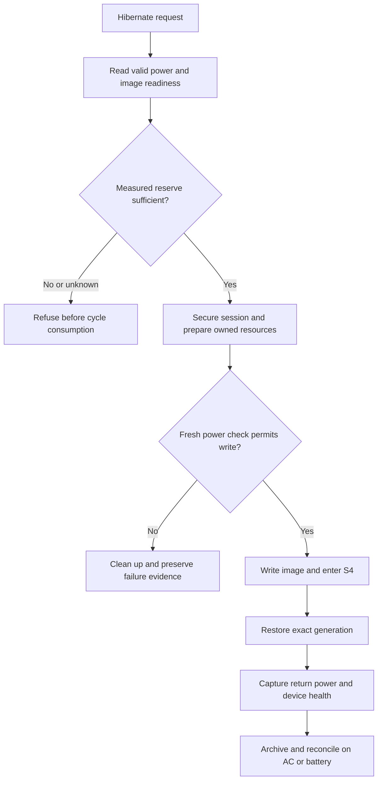
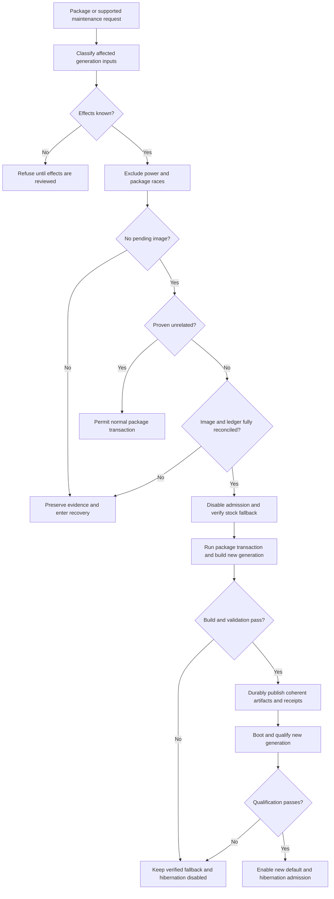

# T2 hibernation production plan

Status: **GOAL NOT DONE**. The goal is permanent hibernation on battery, ordinary safe updates, and a maintainable route to other T2 models. This document distinguishes deployed prototype components from proposed production work; it is not permission for a hardware transition.

## What the prototype proves

MacBookAir9,1 has completed AC-powered normal-logind S4 cycles `064742e3-c4bd-4a5b-b00d-d69590d01837` and `12f886c4-fecb-41ef-ad12-31374e63677d`. The latter followed an ordinary boot through the activated source default and returned to original boot `0f909934-0ecf-4407-863d-6822c81cb2df`; the original vendor-service process completed archive, cleanup, slot retirement and reconciliation. A third, attended battery-only cycle `0b8fa4cf-7055-45a5-aa9f-99538a02564e` returned that same original boot and reconciled successfully with ADP1 offline before and after. The operator returned to a usable desktop. See [actual evidence and historical limits](HIBERNATION.md).

This establishes attended AC and battery operation on the exact source/v16 restore pair, with the battery result using reviewed runtime `e489bab7`. It does not establish a measured low-battery policy, normal update compatibility, unattended recovery, broad T2 support or long-term reliability. Historical qualification flags and consumed guards remain unchanged; successful return is not authority to replay a consumed vector.

## Current guardrails and actual constraints

| Current condition | Meaning | Required production work |
| --- | --- | --- |
| V2 product has provisional battery admission; historical trial remains AC-only | One attended battery-only S4 restored successfully under deployed runtime `e489bab7` | Measure and validate reserve boundaries and recovery; retain historical trial semantics |
| Return and retirement accept truthful AC or battery observations | Battery-only cycle reconciled on hardware without treating unplugging as unhealthy | Test relevant power-source transitions and failure boundaries |
| Every package transaction is blocked while enabled | Temporary protection against an obsolete source default or changed runtime dependencies | Replace with a reviewed update lifecycle, not deletion or bypass of the guard |
| Exact pair, modules, initrd and resume identities are pinned | Compatibility boundary for a saved memory image and cold restore | Generate, publish and qualify coherent generations after relevant updates |
| Production `.linux` and `.cmdline` must match private images byte-for-byte | Current hardware safety requirement; replacement-kernel images repeatedly failed to mount physical root | Preserve this rule; do not retry rejected replacement images |
| Model, PCI and root layout are fixed | Prototype scope, not a generic T2 contract | Introduce reviewed platform profiles with independent device evidence |

The all-package guard is [the `PreTransaction`/`AbortOnFail` hook](../../packages/t2-suspend/hibernate/00-omarchy-t2-hibernate-guard.hook), backed by [update admission](../../packages/t2-suspend/hibernate/update_guard.py). It also blocks dangling or malformed active/pending state, routine opt-in and EFI overrides. Removing the hook, disabling hooks or running manual image/module rebuilds does not solve update compatibility. The present supported fallback is [reviewed native deactivation](../../packages/t2-suspend/hibernate/boot_policy_native.py), with exact stock restoration and retained evidence; it is not the final ordinary-update experience.

## Battery admission: all current gates

The following inventory describes the previous `608464dd` runtime and explains why deleting one mains check was insufficient. Runtime `e489bab7` is now deployed with v2 battery admission and truthful post-return AC observations: continuity, slot retirement and the archived-retirement adapter accept either strict boolean value for `ac_online` while retaining every other healthy-device predicate. Fixture tests cover battery returns and power changes between cleanup samples. One attended battery-only S4 has since returned and reconciled on hardware; that is not qualification of low-reserve boundaries or other machines.

- [Product `_admission_state`](../../packages/t2-suspend/hibernate/product.py) requires a `Mains` supply with `online=1`. Native activation and deactivation reuse product admission, so their current pre/post checks inherit the requirement.
- [Trial `_ready`](../../packages/t2-suspend/hibernate/trial.py) independently requires live mains for the historical attended trial path.
- [Host observation](../../packages/t2-suspend/hibernate/host_observation.py) reports `devices.ac_online`; this is an observation, not itself a rejection.
- [Continuity `Collector.finish`](../../packages/t2-suspend/hibernate/continuity.py) demands an exact healthy-device dictionary containing `ac_online=true` after cleanup.
- [Slot retirement `_health_expected`](../../packages/t2-suspend/hibernate/slot_retirement.py) demands the same value during terminal retirement. Changing only initial admission would leave battery returns unreconciled.
- Historical [successful-v16 cleanup](../../packages/t2-suspend/experiments/cleanup-successful-v16-slots.py), [readback runner](../../packages/t2-suspend/experiments/hibernate-readback-ftrace/run-live-readback.py), [EFI boundary runner](../../packages/t2-suspend/experiments/hibernate-pre-write-ftrace/run-efi-boundary.py) and [cold-PCI proof](../../packages/t2-suspend/experiments/cold-pci-restore-proof.py) contain separate AC checks or AC-bound evidence. Preserve their historical semantics; do not silently relabel old diagnostic receipts as battery qualification.

The production battery policy must record mains, battery presence, measurement validity, reserve and charging/discharging state separately from device health. Refine thresholds from measured image write, shutdown and recovery needs; percentages alone are not an established safety margin. Qualification may begin with an explicitly provisional engineering threshold rather than pretend that an endurance measurement already exists. Missing/invalid readings, low reserve or inconsistent supplies reject initial admission without consuming a cycle. Recheck immediately before image writing; an unplug event must lead to either a still-safe battery admission or a controlled pre-write refusal with owned cleanup. A healthy battery return must reconcile without requiring a charger to be reconnected.

### Source implementation for attended battery qualification

[`power_supply.py`](../../packages/t2-suspend/hibernate/power_supply.py) samples actual sysfs attributes twice, retaining their native units and allowing ordinary numeric drift while requiring stable device identity, presence, status and mains state. Missing optional readings remain unknown. A bounded sampling interval detects slow sampling, not stale firmware caches; userspace cannot make the subsequent physical power transition atomic with the reads.

[`power_policy.py`](../../packages/t2-suspend/hibernate/power_policy.py) supplies an explicit provisional policy, selected only by product configuration schema `omarchy-t2-qualified-product-config-v2` with a `power_policy` object. Its schema is `omarchy-t2-attended-battery-policy-v1`; `min_charge_percent` must be an integer from 30 through 100. This range is an engineering guard for attended qualification, **not a measured endurance guarantee or the final automatic low-battery hibernation policy**. Existing v1 configurations and the historical trial retain AC-only admission.

Off mains, the policy requires exactly one present battery with a known noncharging status and sufficient native `charge_now/charge_full` reserve, or `energy_now/energy_full` only when charge readings are absent. It never substitutes firmware `capacity`, mixes charge and energy units, or accepts an incomplete charge pair by falling back to energy. Valid mains permits missing battery reserve; malformed present telemetry remains a refusal even on mains. Initial admission precedes cycle allocation; the backend rechecks after synchronization and immediately before writing `disk`. A late refusal uses existing cleanup and failure evidence and does not reset or replay the consumed vector.

This implementation is now installed as runtime `e489bab7` with a 30% threshold. The first explicitly approved battery-to-battery S4 succeeded with preflight charge `3418000/3518000` microamp-hours, ADP1 offline before and after, same original boot and successful original-process reconciliation; see the [battery checkpoint](HIBERNATION.md#first-attended-battery-only-s4-restored-the-original-session). Boundary tests and measured refinement remain necessary before claiming permanent battery support. Low reserve can also refuse native activation/deactivation because those operations reuse admission; separating maintenance power requirements remains production work.

A read-only snapshot on the current MBA found charge/current/voltage fields, but no energy/power or capacity-level fields. While `status=Full` and mains was online, `charge_now=3440000`, `charge_full=3518000`, `charge_full_design=4381000`, `current_now=0`, `voltage_now=12507000`, and `capacity=79`. Charge/full is approximately 97.8%, whereas charge/design is approximately 78.5%; this snapshot does not establish how firmware computed `capacity`, a discharge budget or a safe reserve threshold. [Linux power-supply documentation](https://docs.kernel.org/power/power_supply_class.html) defines charge in microamp-hours, energy in microwatt-hours and voltage in microvolts; do not interchange them or invent an energy measurement from a percentage. Initial policy belongs before cycle allocation; a fresh check also belongs at the final writer after preparation/hooks and other slow work.

The first battery cycle's archived evidence does not contain the exact final pre-write reserve; its documented `3418000/3518000` value came from the separate read-only preflight. New source-only power evidence records address that gap prospectively. After reserving a cycle, an exclusive `power-admission-<cycle>.json` records the actual admission snapshot and decision under the ledger lock. The final post-sync check retains its snapshot and decision in the original process, with no added disk logging between that check and the power write. Only after the power callback returns and the collector records that return does `power-prewrite-returned-<cycle>.json` persist the retained measurement; it explicitly says `persistence_phase=after-write-return`. A reset or failure to return may therefore leave only the admission record. These records cannot be retroactively created for the earlier battery cycle.

An additional `power-postreturn-<cycle>.json` records native-unit return telemetry or an explicit unavailable/error observation. It is not a new reserve admission gate: a below-threshold return must not be treated as a failed resume merely because reserve dropped. Persistence errors still trigger the existing cleanup/failure path without hiding that the power callback returned. These additive cycle-bound records neither replace the original eight-member evidence archive nor issue qualification, and monotonic sample timestamps do not measure powered-off duration. The changes are not deployed; installed runtime `e489bab7` and the provisional threshold remain unchanged.

Text equivalent: admit only valid sufficient reserve and compatible image state; secure the session; prepare; recheck before the write; refuse and clean up if unsafe; otherwise enter S4 and restore the exact generation. Record the actual return power source, then reconcile based on health and integrity rather than mains presence. Image-write or restore failure enters explicit recovery and never triggers an automatic second sleep body.

Acceptance requires meaningful fixtures for unknown/low reserve, disappearing supplies, charging-state changes and unplug races, including failures at post-return and retirement boundaries. Controlled hardware evidence must include battery-to-battery S4 with original-process return and usable input/network/audio, AC-to-battery transitions at relevant boundaries, and low-reserve refusal without a consumed vector. Distinct successful cycles establish behavior; failed hardware vectors remain terminal.

## Normal updates: proposed generation transaction

### Runtime-only upgrade groundwork

The source `runtime_deployment.py` contains a bounded runtime/configuration upgrade core with a fixture-only public entry. [`runtime_upgrade_native.py`](../../packages/t2-suspend/hibernate/runtime_upgrade_native.py) supplies the fixed privileged integration: it must be installed root-private outside the replaceable runtime, with separate exact approval of its own bytes, the current boot, old/new runtime/configuration authority and unchanged host files. It verifies reviewed code before importing it, reuses the verified installed power-idle checker, validates the real inhibitor parent, and holds package/physical exclusion around the core's deployment lock. The source adapter is not permission to run an unreviewed workspace copy. This is preparation for deploying the battery policy, **not implementation of ordinary package-update compatibility**. It preserves the existing image pair, boot policy, opt-in, package hook, qualification and consumed-cycle evidence. The configuration change is restricted to v1 → v2 plus the explicit battery policy; all artifact fields stay identical.

The installed old runtime does not recognize a new upgrade-specific pending filename. For this migration, an exclusively created `source-default-activation.pending` file therefore serves as a backwards-compatible admission veto. Its payload explicitly identifies a runtime upgrade, not a boot-policy activation; never feed it to the boot-policy transition engine or interpret it as a completed boot transition. A separate upgrade intent tracks the operation. Keep the opt-in present: removing it could select stock hibernation instead of refusing the incomplete upgrade. Retain old runtime, review, bootstrap and configuration bytes; validate the complete replacement under the still-present barrier; only a completed, verified transaction may remove its own barriers. An interrupted upgrade needs evidence-led reconciliation, not an automatic retry or deletion of pending files.

The existing qualification receipt remains historical authority for the exact image pair and its attended AC evidence. Neither a runtime upgrade nor a v2 configuration turns it into battery validation. The distinct battery test is recorded separately in the [journal](HIBERNATION.md#first-attended-battery-only-s4-restored-the-original-session), without rewriting previous qualification or consumed guards.

The native adapter checks the old installation normally, verifies the new installation while its own barrier is still present, then requires ordinary admission after publication before releasing the package/physical locks. A final admission or package-lock-release failure reinstates the owned veto while the physical lock is still held. It takes no alternate-root, force, qualification or power-action arguments. Actual deployment still requires a separately reviewed root-private candidate inventory, bootstrap, configuration and approval; passing synthetic tests does not establish battery hibernation.

### Package and artifact generations

#### Actual Omarchy entry point and source-only no-image prerequisite

The coordinator belongs in [`omarchy-update`](../../bin/omarchy-update) before cache pruning and snapshot creation, not merely around `omarchy-update-system-pkgs`. The subsequent keyring setup, main system transaction, migrations, AUR update and orphan removal can each mutate installed packages; cache pruning can also remove retained fallback versions. The existing user update lock and `sleep:idle` helper do not own the hibernation physical lock or shutdown exclusion. Preserve the normal unprivileged AUR/build context; a coordinator is not permission to run the entire user update workflow as root.

The current pre-transaction hook cannot call the existing native deactivator: pacman already owns `db.lck`, which that deactivator must acquire. A reviewed top-level handoff must establish the verified ordinary stock boot fallback and persistent hibernation veto before releasing its package lock to real package transactions. Stock fallback means ordinary bootability, **not permission to run unqualified stock hibernation**. A future maintenance intent needs an exact, separately recorded protocol accepted by update admission while still rejected by both routine and stock sleep routing; arbitrary pending files must continue to refuse. This is proposed integration, not an installed bypass.

[ALPM hook documentation](https://man.archlinux.org/man/alpm-hooks.5.en) confirms alphabetical pre/post hook ordering, pre-transaction-only `AbortOnFail`, and that post-transaction hooks are skipped when a transaction fails. Therefore post hooks cannot be the sole cleanup or reactivation mechanism. The current hook has no `NeedsTargets`; even adding matched package names would not establish versions, file effects, scriptlet effects or a safe rollback.

Before any root or boot mutation, combine the existing reconciled ledger and absent EFI-stage checks with a read-only header check at the actual Btrfs-mapped resume location. The source-only [`image_state.py`](../../packages/t2-suspend/hibernate/image_state.py) now reuses the existing experimental header parser on one bounded read from the verified opened device: it checks the mapper's major:minor identity, configured resume control, swapfile mapping and offset, then rechecks target identity and topology. It accepts only an exact version-1 `SWAPSPACE2` header; pending, legacy, unknown and truncated headers refuse. Its [nine synthetic tests](../../packages/t2-suspend/tests/test-hibernate-image-state.py) pass, but the helper is **not deployed or integrated into update admission**. A normal signature alone does not establish a safe ledger, compatible root or disposable image; a failed restore can already have cleared that signature. Never erase a signature or recreate swap to make admission pass.

The source implementation now also calls this helper from `boot_policy_native.py` before and after activation/deactivation, after the existing product admission succeeds. The adapter imports it only after verifying the reviewed runtime inventory; the transition holds package/physical locks and the real inhibitor during both checks. A failed initial check precedes transition writes; a failed postcheck retains the pending veto. Nineteen native-adapter tests pass, including pending-image refusal for both actions and phases and reviewed-import ordering. This wiring is not deployed: the installed `e489bab7` runtime remains unchanged, including through the later battery-only S4. It does not introduce a native maintenance action or relax the package guard.

The transition core also has a **fixture-only maintenance handoff**, unavailable through the native CLI and explicitly rejected on the live root. It uses existing deactivation checks, retains the old policy and opt-in evidence, and durably records `package-maintenance.pending` before retiring `source-default-deactivation.pending` or releasing package/physical exclusion. The identical archived intent binds its transition ID, old policy, reviewed runtime, pair receipt, fallback configuration and deactivation completion. Thus interruptions retain the old transition veto, the maintenance veto, or both. Both stock and routine sleep admission reject the maintenance marker by presence, including malformed records. The package guard also rejects it: this groundwork does **not** yet authorize any package transaction. No live marker has been created. Native coordinator admission, transaction-effects verification and automatic coherent reactivation remain required before this handoff can be used for normal updates.

[The current DKMS installer](INSTALLATION.md) builds against matching headers, verifies selected replacement modules and initrd provenance, preserves rollback receipts and avoids live module loading. Its post-transaction hooks cannot roll back an entire package transaction. [Package source policy](../../packages/t2-suspend/README.md) and [source-default policy](../../packages/t2-suspend/hibernate/boot_policy.py) must therefore be integrated with a new update coordinator rather than assumed to provide image compatibility already.

Define a generation containing production/source/restore UKIs, exact kernel and command-line sections, kernel release, selected root and initrd module identities, firmware, restore hooks, reviewed runtime, root-unlock method, resume device and physical offset, and qualification evidence. Include dependency and filesystem state needed to restore an old memory image safely. Kernel ABI equality alone is insufficient; an old restored userspace must not run against silently changed root files or modules.

Classify transactions before mutation. Unrelated package updates may proceed only after the dependency classifier is validated; kernel, headers, DKMS, firmware, initcpio, cryptsetup, storage, bootloader and restore/runtime changes require the generation path. Unknown effects stay refused. Direct supported maintenance commands and snapshot rollback need the same interlock; manual root bypass remains outside cooperative protection and must invalidate admission visibly.

Text equivalent: unknown effects refuse admission. Every admitted transaction owns real power exclusion, package serialization and the physical lock while checking and preserving the no-pending-image condition. A proven unrelated transaction can then proceed without altering compatibility. A relevant transaction resolves ledger state, disables hibernation and establishes a verified fallback, then updates and builds a new generation. Publish only a coherent verified artifact set; activate it only after required boot/restore qualification. Failed or interrupted work leaves an explicit recorded state with a verified boot choice and hibernation disabled, never mixed pins or automatic requalification.

This flow is proposed. Kernel/package mutation and multi-file ESP publication are not made atomic merely by a rename or ALPM hook. The implementation must define durable phase records, file and directory fsync, exclusive publication, exact readback, retained known-good artifacts and recovery at every boundary. A running old kernel must not hibernate against a newly installed incompatible root/module generation; admission remains disabled until a qualified matching ordinary boot. Define fallback ownership across kernel/module package removal so an old UKI is not assumed bootable without its required root-side modules.

### Image compatibility and recovery states

- **Idle/qualified:** no unresolved image or ledger state; exact generation admitted. Existing configuration and receipts remain immutable historical evidence.
- **Image pending:** prohibit package/root/boot mutation until the owning generation resumes or a reviewed discard decision resolves the image. Never restore a saved memory image after incompatible kernel, module, filesystem or userspace changes.
- **Discard required:** preserve intent, image header/identity and consumed-cycle evidence; validate the exact resume device and physical offset; invalidate only the identified image using a reviewed method; verify the normal header and stock boot policy before updates. No blind restore, swap recreation, guard reset or guessed offset.
- **Update pending:** stock/fallback verified, hibernation disabled, durable generation transaction recorded. An interruption requires phase reconciliation, not replay of an already consumed action.
- **Build/qualification failed:** retain evidence and a verified fallback; report hibernation unavailable. Do not silently enable an obsolete private source default or reuse the prior generation's qualification.
- **New generation qualified:** publish its separate qualification and policy, then enable admission. Keep old evidence; retire old artifacts only when no image, receipt or supported fallback requires them.

Encryption is part of the compatibility contract: LUKS identity, unlock availability, mapping, root subvolume and resume mapping must agree before any write or resume. Do not copy this dedicated test machine's embedded-key choice to other users or expose key material in manifests. Btrfs swapfile relocation, resizing, snapshot changes and device renumbering must invalidate stale resume metadata. A changed physical offset requires regeneration and validation of both ordinary and restore boot paths.

Under the current boot design, every private UKI must preserve its generation's production `.linux` and `.cmdline` exactly. Do not stage the failed marker-source SHA-256 `974246c01bdc329917651b35f5dbe0b80e2f5e4125987f7c0050e20e4fc39ffd`, rejected v1/v2 images or another replacement-kernel diagnostic. Future normal kernel updates need a separately validated packaged-kernel generation lifecycle; they are not permission to retry failed diagnostic images.

Acceptance requires transaction classification tests, genuine ALPM ordering/admission evidence, DKMS/build failures, disk-full/readback/fsync faults, interrupted publication, stale-image refusal/discard, changed offsets/encryption and rollback across module removal. Validate representative normal updates on the MBA followed by an ordinary boot and a distinct normal-logind S4 cycle on the new coherent generation. Guard replacement requires reviewed code and these relevant checks; simply deleting the all-package hook fails acceptance.

The production qualification policy is an open design decision, not implemented. Define which structural, module, boot and runtime checks can run automatically, when evidence for a supported tested release/model may be reused with newly verified generation identities, and which new kernel or hardware combinations need fresh maintainer qualification. Never reuse obsolete artifact pins as current authority. Routine supported updates must not require Codex, manual experimental approval or an attended S4 test for every package transaction. Unsupported combinations should leave hibernation temporarily unavailable with a verified ordinary boot path, rather than indefinitely prevent operating-system updates; that behavior needs implementation and acceptance evidence before replacing the present guard.

For a proven unrelated update, existing exact-pair activation is a reusable building block: it verifies the reviewed runtime, retained qualification, pair receipt, production/source/restore UKIs and exact Limine configuration without issuing new qualification. Those checks alone do not prove that an update was unrelated: root-side modules, firmware, unlock dependencies and package scriptlet effects are not exhaustively covered. Add an explicit dependency/effect check before permitting automatic reuse. The update guard's stock-entry syntax check also does not verify the actual production UKI bytes; it is not an ordinary-boot fallback verification by itself.

In particular, `host_observation.Sampler.runtime()` checks selected modules in the extracted source image and the Bluetooth runtime override, not every driver that ordinary root-side `modprobe` would select after an update. The DKMS installer's `check_selection()` compares `srcversion` and kernel ABI, while `check_images()` checks required firmware filenames in the initramfs listing; neither proves unchanged root-side bytes. Reactivation must not accept a caller's `unrelated=true` flag or a receipt that merely repeats that claim. Anchor actual before/after dependency inventories to the maintenance intent before the first package mutation, and separately account for transaction effects that file equality alone cannot establish.

The source-only [`root_driver_inventory.py`](../../packages/t2-suspend/hibernate/root_driver_inventory.py) supplies a bounded part of that evidence: the seven T2 modules selected from the requested kernel's root-side module tree, their actual file hashes and sizes, selection paths and module metadata, and the `brcmfmac4377b3-*` firmware set including all five required Formosa files. It records firmware link targets as well as bytes. It returns inventory data, not an update-safety or qualification verdict. Root-side selection was checked read-only on this MBA: all seven currently resolve through `//lib/modules/<release>/updates/dkms/<module>.ko.zst`, with `/lib` linked to `usr/lib`; the double slash is emitted by `modinfo -b /` and is covered explicitly. The new helper has not been run on the live root or deployed.

The source-only [`root_control_inventory.py`](../../packages/t2-suspend/hibernate/root_control_inventory.py) complements those driver bytes with a fixed, partial control inventory: sleep configuration and relevant service overrides, module selection/loading configuration, initcpio hooks and presets, unlock tables, kernel command-line files, Limine generation configuration and pre/post hooks, DKMS framework configuration, and the installer's Bluetooth/radio controls. It records missing versus empty directories, names, modes, file hashes, and confined symlink targets; `/dev/null` masks are recorded without opening the device. Configurations and hooks are never evaluated or executed, and referenced encryption keys, Bluetooth bonding state and NetworkManager connection secrets are outside its scope. Two matching bounded reads detect observed changes but are not an atomic snapshot. Empty configuration files are permitted without relaxing the driver reader's default rejection of empty modules.

These helpers are not the complete dependency inventory. Non-T2 storage and display modules, other firmware, executable/shared-library dependencies, effective selection semantics and transaction effects still need coverage before automatic reactivation. No before-update baseline has been issued from either helper, and no receipt may treat equality of their partial inventories as an unchanged generation. Live capture must run from reviewed code while the coordinator holds the required exclusion; a path check does not substitute for review or locking. The control helper has only synthetic fixture coverage and has not been deployed or invoked against the live root. Neither helper changes the installed package guard or authorizes an update.

## Shared platform and device-specific ports

| Area | Shared mechanism candidate | Required profile and port evidence |
| --- | --- | --- |
| Desktop lifecycle | Logind inhibitors, secure session, owned freeze/thaw, hooks, archive and ledger | Distribution/systemd/desktop versions, hooks, homed policy and successful real return |
| Boot and image lifecycle | Generation manifest, pending-image interlock, transactional publication | Bootloader/EFI behavior, ESP layout, root encryption, unlock, filesystem and resume device/offset |
| T2 transport | BCE DMA ownership and ordered source/restore isolation | PCI topology, suppliers/children, controller revision, firmware and exact driver identities |
| Built-in input/audio | Dependency ordering and post-return health capture | Keyboard/trackpad transport, audio topology and actual usable input/audio after resume |
| Radios | Coordinated quiesce/reconnect policy | Wi-Fi/Bluetooth chip IDs, board firmware/NVRAM and recovery behavior |
| Power | Measured reserve policy and explicit recovery | Battery telemetry, ACPI S4, power-on behavior and battery restoration evidence |

MacBookAir9,1 is the validated prototype only. Other T2 MacBook Air/Pro/iMac/Mac mini/Mac Pro models are untested; T2 presence does not establish matching PCI addresses, BCM4377 firmware, BCE/VHCI ordering or boot behavior. Desktop models may have no battery. Start each port with read-only inventories and a reviewed profile, then offline module/boot validation, ordinary boot evidence and distinct attended S4 evidence. Never weaken the MBA's fixed identities to accept unknown hardware or claim a port from compile-only results. Track each model/device revision as untested, inventoried, boot-validated or S4-validated with exact evidence.

## Objective completion checklist

- [ ] Battery policy implemented across admission, continuity and retirement; healthy battery return reconciles and low/unknown reserve refuses safely.
- [ ] MBA battery S4 and relevant power-source transitions validated without repair, with truthful original-process and usable-device evidence.
- [ ] Normal unrelated updates work; relevant updates produce coherent qualified generations without a perpetual all-package block.
- [ ] Pending-image compatibility/discard, interrupted update recovery and retained fallback validated; no stale-image restore or blind retry.
- [ ] Reviewed permanent installation, migration, upgrade and removal paths replace prototype-only private provisioning; production operation does not depend on Codex handoff/autoresume helpers.
- [ ] User-facing status explains unsupported hardware, unsafe reserve, update/recovery state and the safe fallback; documents match deployed behavior.
- [ ] Platform profiles and port matrix are implemented with explicit unsupported-model refusal; actual support claims name independently tested models.
- [ ] Ordinary boot, representative update and distinct normal-logind battery S4 succeed on the permanent MBA deployment; retained evidence supports each claim.

The goal remains unfinished until these requirements are handled. Existing AC and first attended battery success should be retained as milestones, not replaced with a claim that measured low-battery safety, normal updates or other T2 support already exists.
