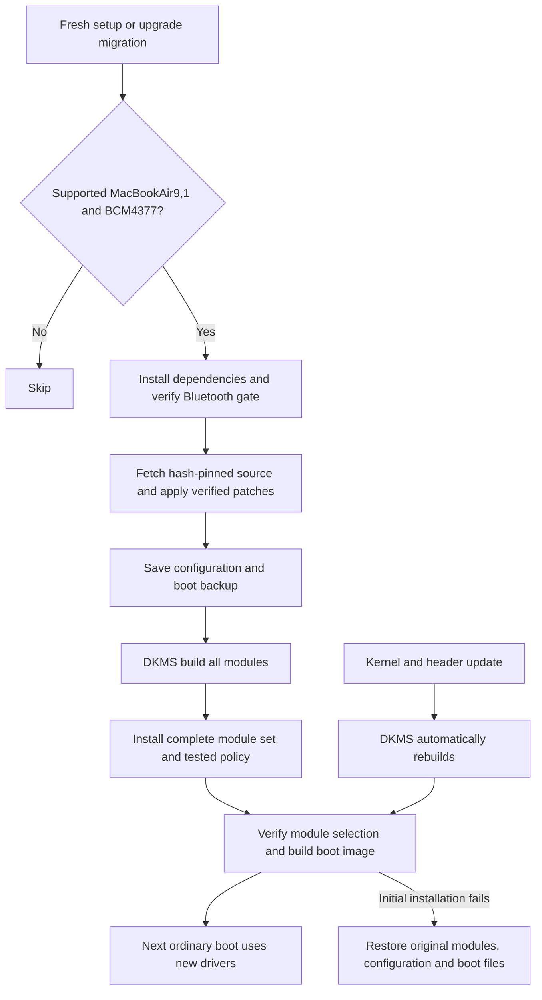

# Automatic T2 suspend driver installation

Fresh hardware setup and the upgrade migration now install the driver set automatically on Apple MacBookAir9,1 with the validated BCM4377 Wi-Fi PCI identity and a detected T2 chip. The existing Bluetooth installer establishes boot ordering first. The shared suspend installer downloads hash-pinned driver source, reproduces the `wifi-reenable` source profile, registers it with DKMS, builds all five modules against installed `linux-t2` headers, installs the complete set, verifies selection and ABI, and rebuilds the normal T2 boot image through `limine-mkinitcpio`. It does not unload modules, toggle radios, restart Bluetooth, suspend, or reboot. The next ordinary boot activates the installation.

## Entry points

- Fresh setup: `install/hardware/apple/fix-t2-suspend.sh`, immediately after the Bluetooth gate leaf in `install/hardware/all.sh`.
- Existing installations: migration `1789256882.sh` calls `omarchy-setup-t2-suspend` on supported hardware. Any setup error propagates and leaves the migration pending.
- Repair/inspection: `omarchy setup t2-suspend`, `omarchy setup t2-suspend --verify`, and `omarchy setup t2-suspend --rollback` use the same manager.

Setup installs DKMS, matching T2 headers, compiler, make and patch through Omarchy's package helper. The source fetcher needs only Python's HTTPS support; every file is checked against the committed SHA256 manifest. There is no unpinned kernel-tree checkout, external package publication dependency, downloaded binary driver, or full kernel build. Source is prepared before live configuration is changed.

## Installed files and policy

| Location | Purpose |
| --- | --- |
| `/usr/src/omarchy-t2-radio-1.0/` | Verified driver source and DKMS build description |
| `/var/lib/dkms/omarchy-t2-radio/` | DKMS builds, installation records and archived original modules |
| `/usr/share/dkms/modules_to_force_install/omarchy-t2-radio` | Replace the complete radio set even when a vendor companion's source version equals stock |
| `/etc/modprobe.d/omarchy-t2-suspend.conf` | Enable the model-scoped Wi-Fi recovery option from the tested image |
| `/etc/bluetooth/main.conf` | Set `[Policy] ResumeDelay = 5`; preserve other content and refuse a conflicting explicit administrator value |
| `/etc/NetworkManager/conf.d/99-omarchy-t2-radio.conf` | Reproduce the tested interface-specific scan-MAC policy |
| `/usr/lib/initcpio/install/omarchy-t2-suspend` | Check replacement modules before boot-image publication and include Wi-Fi modules |
| `/etc/mkinitcpio.conf.d/zz-omarchy-t2-suspend.conf` | Append that verification hook |
| `/var/lib/omarchy-t2-suspend/receipt.json` | Original/installed configuration, source identities and transaction state |
| `/var/lib/omarchy-t2-suspend/boot-*/boot/` | Boot backup made before initial installation |

The scan policy disables scan MAC randomization only on the tested interface. It is included to reproduce the latest tested configuration, not because it independently solved the firmware stall; connection-profile MAC policy is unchanged. The Bluetooth delay and Wi-Fi option take effect with the next boot, along with the modules. The driver patches themselves retain their documented hardware checks. The Wi-Fi FLR helper remains an experimental recovery path: the latest functional pass did not exercise it, and the earlier reboot remains unexplained.

The retired Wi-Fi-unload sleep service remains removed. The Wi-Fi recovery watcher and Bluetooth startup gate retain their separate ownership and rollback receipts. This installer checks the gate before proceeding; it refuses conflicting custom service overrides or lab arrangements instead of overwriting them. DKMS configurations that request immediate live module loading are refused.

## Kernel updates and failure behavior

Arch's DKMS hook runs before the normal mkinitcpio hook when kernel/header files change. DKMS rebuilds this source for installed kernels ending in `-t2`; matching headers are required. The scoped force-install record ensures the three vendor companion modules are not rejected merely because their source versions are unchanged. DKMS stores original modules for removal. See the [DKMS documentation](https://github.com/dkms-project/dkms/blob/main/dkms.8.in) for module lifecycle and [pacman hook semantics](https://man.archlinux.org/man/alpm-hooks.5) for transaction ordering.

The initcpio hook checks every selected module's source version against its DKMS build and verifies the target kernel ABI. Missing or mismatched replacements terminate mkinitcpio before image publication. Returning an ordinary hook error is insufficient: mkinitcpio can otherwise write an incomplete image and return failure afterward. Bluetooth is checked on the root filesystem but not explicitly added to the initramfs; it still loads through the existing readiness gate. Image inspection also rejects early Bluetooth inclusion.

During initial installation, all builds complete before any replacement is installed. A subsequent installation, selection, or boot-image failure removes the owned DKMS registration, restores configuration and original modules, and restores the boot snapshot. Edited administrator files or source are preserved and cause an explicit error. An interrupted transaction remains recorded for rollback. Repeated completed installation verifies state and does not rebuild unnecessarily.

A later manual rollback rebuilds the boot image for the currently installed kernel rather than restoring an obsolete kernel image from the original installation. DKMS removal restores its archived original drivers. Backups and the receipt remain for audit. Other T2 support components remain installed.

Automatic rebuilding is not a guarantee of compatibility with arbitrary future kernel APIs. An incompatible update reports a build failure and the boot guard prevents silently publishing an image with the wrong radio modules. Maintainers must update and validate the source profile when the kernel changes incompatibly. Source/installer revisions must bump the DKMS version, update the hook's version reference and provide a corresponding upgrade migration; changing an installed version's source in place is not supported. A full package transaction is not rolled back by a post-transaction hook.

## Validation boundary

The exact HTTPS source-fetch path and DKMS build were exercised in temporary directories against the installed T2 headers. Real DKMS installation into a temporary module tree exercised original-module archival and replacement. Transaction fixtures cover idempotence, build/install/image failures, boot/configuration restoration, administrator conflicts, source drift, missing headers, early Bluetooth and exclusion of power/radio commands. Shell fixtures cover fresh setup, migration, CLI verification/rollback and error propagation. No live driver installation or fresh hardware boot of this installer has been claimed.

The earlier hardware suspend results remain the evidence for the driver behavior. This integration makes automatic delivery concrete, but neither fixes the unresolved hibernation/S4 issue nor expands qualification to other Mac models.

### Completed integration checks

The real source fetch passed all pinned hashes. DKMS3.4.3 built all five modules in `/tmp`; their source versions matched the tested candidate, including Wi-Fi `E8C051F8EBDA8DE23852575` and Bluetooth `4DF58889A43B9AC7E9E3E8C`. Actual DKMS installation into a temporary module tree archived the copied originals. Actual removal restored all five stock files byte-for-byte and left no override modules.

A real mkinitcpio image generated under `/tmp` passed with the installed hook, all replacement Wi-Fi modules and the source-verification marker; Bluetooth was absent from early boot as intended. Missing dependencies in an earlier incomplete fixture exposed the need to terminate on accumulated build errors, which the final hook checks. No live `/boot` or system module files were modified.

Twelve installer tests and five source-preparation tests passed, along with shell setup/migration/CLI/error-routing fixtures. Existing trackpad, T2 hardware, Bluetooth installer/gate, Wi-Fi recovery and sleep-retirement suites passed. The CLI suite passed; it retained its unrelated sandbox theme-lock warning. This is isolated installation/build validation, not a fresh hardware boot of the automatic installer.

### First live deployment: ready for ordinary boot

On September12, the committed installer was run on the test MacBookAir9,1. DKMS installation and the manager's verification passed. Independent extraction of the generated normal T2 UKI confirmed the unchanged stock kernel, all four matching Wi-Fi modules, embedded policy and source marker, and no early Bluetooth module. All existing test images and their menu entries were preserved. The separate lab verifier subsequently changed the normal image, invalidating its menu hash; see the incident below.

The temporary lab Bluetooth load override was backed up and removed without unloading Bluetooth. A lab-only `noresume` guard prevents the old hibernation target from being used during this S3-driver boot validation; it is not part of the automatic installer. The running session remains on the earlier test image. A user-operated boot of the normal entry is the next validation step; no such hardware pass is claimed yet.

### Lab verification caused a pre-boot hash failure

The first ordinary boot attempt stopped at Limine with “URI wrong hash,” before Linux executed. The separate lab verifier used `objcopy --dump-section` on the live UKI without an output filename. Objcopy rewrote the PE image in place after the verifier's initial menu-hash check. This was a verification-tool defect, not evidence of a driver initialization failure. The automatic installer's `lsinitcpio` path supplies `/dev/null` as an explicit output and does not have this defect.

The lab verifier now inspects a private copy, supplies a separate output filename, and checks that both the live image and menu remain unchanged afterward. The faulty invocation was reproduced on a disposable copy. The normal UKI and menu were regenerated through `limine-mkinitcpio` using the already installed stock kernel and DKMS modules, without compiling a kernel or changing running drivers. Corrected verification checks the menu hash, stock kernel identity, module source versions, boot policy and preservation of all five test images. A successful ordinary hardware boot remains pending.

### Normal boot exposed missing Apple firmware

The next normal boot reached Linux but Wi-Fi failed during initramfs startup: `Direct firmware load for brcm/brcmfmac4377b3-pcie.bin failed with error -2`, followed by `Dongle setup failed`. Bluetooth's dependency gate then timed out with `Wi-Fi netdev not ready; Bluetooth left unloaded`. The driver modules loaded; their Apple board-specific firmware had been omitted from the normal image. The working test image explicitly included those files.

The initcpio hook now copies the installed `brcmfmac4377b3-*` firmware files into the image and aborts if the supported Formosa board's binary, either SPPR NVRAM variant, CLM blob or TxCap blob is missing or empty. These dynamically selected Apple filenames are not covered by the driver's static firmware metadata. Firmware remains sourced from the machine's existing Apple firmware installation; this patch does not redistribute it. The installer also rejects a generated image missing the five required files.

The corrected hook was deployed and the normal UKI regenerated without rebuilding the kernel or driver modules. Independent extraction verified all 15 installed Wi-Fi firmware files byte-for-byte, the stock kernel, replacement Wi-Fi modules, menu hash and preservation of the five test boot entries. Fourteen installer tests and five source tests passed, including missing-firmware rejection and an actual hook failure for each required file. The initial lab deployment encountered a nested verification-lock conflict and rolled back safely; the corrected deployment passed. A fresh normal boot with this firmware packaging change remains pending.

### Normal installed-driver boot passed

On September12, the user returned from the normal entry and confirmed Wi-Fi, Bluetooth and audio working. Boot `fb189f6a-986d-4816-8b86-bf775f4f9a4f` uses stock kernel `7.2.4-arch1-Watanare-T2-1-t2`, without lab command-line markers or a runtime Bluetooth load override. Loaded Wi-Fi source version `E8C051F8EBDA8DE23852575` and Bluetooth `4DF58889A43B9AC7E9E3E8C` match the tested drivers; module lookup selects both from `updates/dkms`. Wi-Fi recovery policy is enabled.

The journal confirms Wi-Fi firmware initialization, then a ready Wi-Fi interface, followed by the Bluetooth gate loading its driver and BlueZ starting successfully. An audio transport became ready and the user confirmed functionality. Existing P2P creation errors and transient BlueZ connection/cache warnings remain in the log; this pass records working normal-boot behavior, not an absence of warnings. This supersedes the pending normal-boot checkpoints above. A clean OS installation and suspend/resume on this normal image have not been validated by this boot; hibernation remains unresolved and the lab `noresume` guard remains installed.

### Normal installed-driver suspend/resume passed

The user subsequently performed a short suspend cycle on the same normal boot and confirmed Bluetooth and audio working afterward. The journal records deep suspend entry at 21:20:27, ACPI S3 entry and low-level resume at 21:20:32, then suspend exit at 21:20:33. This confirms actual S3 entry and return. T2BCE completed its stateful resume successfully. Bluetooth restored its vendor windows, encountered transient HCI command errors, then exercised the patched Bluetooth function reset and reached firmware/RTI readiness while rebuilding HCI. The user-confirmed working audio validates the resulting recovery; this is not a claim of an error-free log.

The Wi-Fi interface was operationally up after resume, though no separate network traffic probe was performed in this checkpoint. Normal boot and one short S3 cycle now pass with the installed drivers. This does not validate overnight battery drain, a clean OS installation, the Wi-Fi function-reset fallback, or hibernation. The earlier test-image validation and its limitations remain documented separately.
