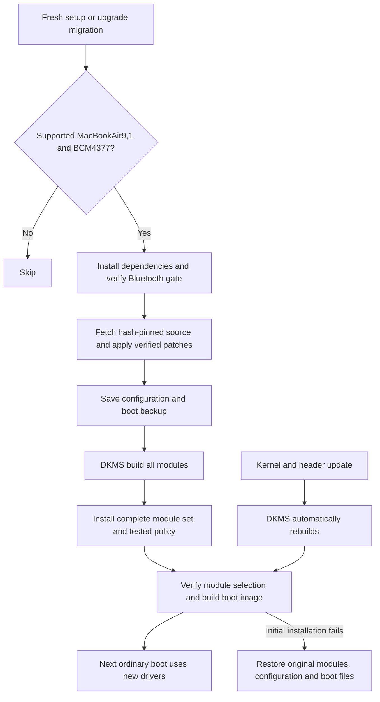

# Automatic T2 suspend driver installation

Fresh hardware setup and the upgrade migration now install the driver set automatically on Apple MacBookAir9,1 with the validated BCM4377 Wi-Fi PCI identity and a detected T2 chip. The existing Bluetooth installer establishes boot ordering first. The shared suspend installer downloads hash-pinned driver source, reproduces the `wifi-reenable` source profile, registers it with DKMS, builds all five modules against installed `linux-t2` headers, installs the complete set, verifies selection and ABI, and rebuilds the normal T2 boot image through `limine-mkinitcpio`. It does not unload modules, toggle radios, restart Bluetooth, suspend, or reboot. The next ordinary boot activates the installation.

## Entry points

- Fresh setup: `install/hardware/apple/fix-t2-suspend.sh`, immediately after the Bluetooth gate leaf in `install/hardware/all.sh`.
- Existing installations: migration `1789256882.sh` calls `omarchy-setup-t2-suspend` on supported hardware. Any setup error propagates and leaves the migration pending.
- Repair/inspection: `omarchy setup t2-suspend`, `omarchy setup t2-suspend --verify`, and `omarchy setup t2-suspend --rollback` use the same manager.

Setup installs DKMS, matching T2 headers, compiler, make and patch through Omarchy's package helper. The source fetcher needs only Python's HTTPS support; every file is checked against the committed SHA256 manifest. There is no unpinned kernel-tree checkout, external package publication dependency, downloaded binary driver, or full kernel build. Source is prepared before live configuration is changed.

## Installed files and policy

| Location | Purpose |
| --- | --- |
| `/usr/src/omarchy-t2-radio-1.1/` | Verified driver source and DKMS build description |
| `/var/lib/dkms/omarchy-t2-radio/` | DKMS builds, installation records and archived original modules |
| `/usr/share/dkms/modules_to_force_install/omarchy-t2-radio` | Replace the complete radio set even when a vendor companion's source version equals stock |
| `/etc/modprobe.d/omarchy-t2-suspend.conf` | Enable the model-scoped Wi-Fi recovery option from the tested image |
| `/etc/bluetooth/main.conf` | Set `[Policy] ResumeDelay = 5`; preserve other content and refuse a conflicting explicit administrator value |
| `/etc/NetworkManager/conf.d/99-omarchy-t2-radio.conf` | Reproduce the tested interface-specific scan-MAC policy |
| `/usr/lib/initcpio/install/omarchy-t2-suspend` | Check replacement modules and include Wi-Fi modules plus required Apple firmware before boot-image publication |
| `/etc/mkinitcpio.conf.d/zz-omarchy-t2-suspend.conf` | Append that verification hook |
| `/var/lib/omarchy-t2-suspend/receipt.json` | Original/installed configuration, source identities and transaction state |
| `/var/lib/omarchy-t2-suspend/boot-*/boot/` | Boot backup made before initial installation |

The scan policy disables scan MAC randomization only on the tested interface. It is included to reproduce the latest tested configuration, not because it independently solved the firmware stall; connection-profile MAC policy is unchanged. The Bluetooth delay and Wi-Fi option take effect with the next boot, along with the modules. The driver patches themselves retain their documented hardware checks. The Wi-Fi FLR helper remains an experimental recovery path: the latest functional pass did not exercise it, and the earlier reboot remains unexplained.

The retired Wi-Fi-unload sleep service remains removed. The Wi-Fi recovery watcher and Bluetooth startup gate retain their separate ownership and rollback receipts. This installer checks the gate before proceeding; it refuses conflicting custom service overrides or lab arrangements instead of overwriting them. DKMS configurations that request immediate live module loading are refused.

## Kernel updates and failure behavior

Arch's DKMS hook runs before the normal mkinitcpio hook when kernel/header files change. DKMS rebuilds this source for installed kernels ending in `-t2`; matching headers are required. The scoped force-install record ensures the three vendor companion modules are not rejected merely because their source versions are unchanged. DKMS stores original modules for removal. See the [DKMS documentation](https://github.com/dkms-project/dkms/blob/main/dkms.8.in) for module lifecycle and [pacman hook semantics](https://man.archlinux.org/man/alpm-hooks.5) for transaction ordering.

The initcpio hook checks every selected module's source version against its DKMS build and verifies the target kernel ABI. Missing or mismatched replacements terminate mkinitcpio before image publication. Returning an ordinary hook error is insufficient: mkinitcpio can otherwise write an incomplete image and return failure afterward. Bluetooth is checked on the root filesystem but not explicitly added to the initramfs; it still loads through the existing readiness gate. Image inspection also rejects early Bluetooth inclusion and missing required Apple firmware. The hook copies installed `brcmfmac4377b3-*` files and requires the Formosa binary, both SPPR NVRAM variants, CLM and TxCap blobs before building. These board-specific filenames are requested dynamically and are absent from static driver firmware metadata.

During initial installation, all builds complete before any replacement is installed. A subsequent installation, selection, or boot-image failure removes the owned DKMS registration, restores configuration and original modules, and restores the boot snapshot. Edited administrator files or source are preserved and cause an explicit error. An interrupted transaction remains recorded for rollback. Repeated completed installation verifies state and does not rebuild unnecessarily. When the receipt names an older owned DKMS version, setup first performs its normal rollback and publishes a stock-driver boot image, then installs the new version transactionally; failure therefore leaves a bootable stock fallback instead of mixed driver revisions.

A later manual rollback rebuilds the boot image for the currently installed kernel rather than restoring an obsolete kernel image from the original installation. DKMS removal restores its archived original drivers. Backups and the receipt remain for audit. Other T2 support components remain installed.

Automatic rebuilding is not a guarantee of compatibility with arbitrary future kernel APIs. An incompatible update reports a build failure and the boot guard prevents silently publishing an image with the wrong radio modules. Maintainers must update and validate the source profile when the kernel changes incompatibly. Source/installer revisions must bump the DKMS version, update the hook's version reference and provide a corresponding upgrade migration; changing an installed version's source in place is not supported. A full package transaction is not rolled back by a post-transaction hook.

## Validation boundary

The exact HTTPS source-fetch path and DKMS build were exercised in temporary directories against the installed T2 headers. Real DKMS installation into a temporary module tree exercised original-module archival and replacement. Transaction fixtures cover idempotence, build/install/image failures, boot/configuration restoration, administrator conflicts, source drift, missing headers, early Bluetooth and exclusion of power/radio commands. Shell fixtures cover fresh setup, migration, CLI verification/rollback and error propagation. The corrected installer has also been deployed on the test machine: a normal boot and a short actual S3 cycle passed with the installed drivers. See the [validation record](VALIDATION.md) for the deployment defects, corrections and observed results. A clean OS installation remains untested.

The earlier hardware suspend results remain the evidence for the driver behavior. This integration makes automatic delivery concrete, but neither fixes the unresolved hibernation/S4 issue nor expands qualification to other Mac models.

