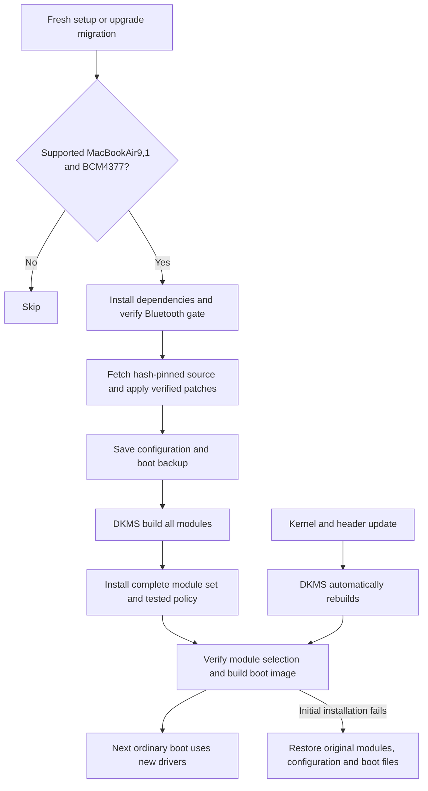

# Automatic T2 suspend driver installation

Fresh hardware setup and the upgrade migration now install the driver set automatically on Apple MacBookAir9,1 with the validated BCM4377 Wi-Fi PCI identity and a detected T2 chip. The existing Bluetooth installer establishes boot ordering first. The shared suspend installer downloads hash-pinned driver source, reproduces the `wifi-reenable` source profile, registers it with DKMS, builds the five radio modules (Wi-Fi and Bluetooth only; never the BCE family) against installed `linux-t2` headers for every kernel whose stock radio fingerprint is qualified, installs the complete set, verifies selection and ABI, and rebuilds the normal T2 boot image through `limine-mkinitcpio`. It does not unload modules, toggle radios, restart Bluetooth, suspend, or reboot. The next ordinary boot activates the installation.

## Entry points

- Fresh setup: `install/hardware/apple/fix-t2-suspend.sh`, immediately after the Bluetooth gate leaf in `install/hardware/all.sh`.
- Existing installations: migration `1789256882.sh` calls `omarchy-setup-t2-suspend` on supported hardware. Any setup error propagates and leaves the migration pending.
- Repair/inspection: `omarchy setup t2-suspend`, `omarchy setup t2-suspend --verify`, and `omarchy setup t2-suspend --rollback` use the same manager.

Setup installs DKMS, matching T2 headers, compiler, make and patch through Omarchy's package helper. The source fetcher needs only Python's HTTPS support; every file is checked against the committed SHA256 manifest. There is no unpinned kernel-tree checkout, external package publication dependency, downloaded binary driver, or full kernel build. Source is prepared before live configuration is changed.

## Installed files and policy

| Location | Purpose |
| --- | --- |
| `/usr/src/omarchy-t2-radio-1.6/` | Verified driver source, DKMS build description, qualification gate and qualified-fingerprint table |
| `/var/lib/dkms/omarchy-t2-radio/` | DKMS builds, installation records and archived original modules |
| `/usr/share/dkms/modules_to_force_install/omarchy-t2-radio` | Replace the complete radio set even when a vendor companion's source version equals stock |
| `/etc/modprobe.d/omarchy-t2-suspend.conf` | Enable the model-scoped Wi-Fi recovery option from the tested image |
| `/etc/bluetooth/main.conf` | Set `[Policy] ResumeDelay = 5`; preserve other content and refuse a conflicting explicit administrator value |
| `/etc/NetworkManager/conf.d/99-omarchy-t2-radio.conf` | Reproduce the tested interface-specific scan-MAC policy |
| `/usr/lib/initcpio/install/omarchy-t2-suspend` | Check the BCE family and radio modules, and include Wi-Fi modules plus required Apple firmware, before boot-image publication |
| `/etc/mkinitcpio.conf.d/zz-omarchy-t2-suspend.conf` | Append that verification hook |
| `/var/lib/omarchy-t2-suspend/receipt.json` | Original/installed configuration, source identities and transaction state |
| `/var/lib/omarchy-t2-suspend/boot-*/boot/` | Boot backup made before initial installation |

The scan policy disables scan MAC randomization only on the tested interface. It is included to reproduce the latest tested configuration, not because it independently solved the firmware stall; connection-profile MAC policy is unchanged. The Bluetooth delay and Wi-Fi option take effect with the next boot, along with the modules. The driver patches themselves retain their documented hardware checks. The Wi-Fi FLR helper remains an experimental recovery path: the latest functional pass did not exercise it, and the earlier reboot remains unexplained.

The retired Wi-Fi-unload sleep service remains removed. The Wi-Fi recovery watcher and Bluetooth startup gate retain their separate ownership and rollback receipts. This installer checks the gate before proceeding; it refuses conflicting custom service overrides or lab arrangements instead of overwriting them. DKMS configurations that request immediate live module loading are refused.

## Kernel updates and failure behavior

Arch's DKMS hook runs before the normal mkinitcpio hook when kernel/header files change. DKMS rebuilds this source for installed kernels ending in `-t2`; matching headers are required. The scoped force-install record ensures the three vendor companion modules are not rejected merely because their source versions are unchanged. DKMS stores original modules for removal. See the [DKMS documentation](https://github.com/dkms-project/dkms/blob/main/dkms.8.in) for module lifecycle and [pacman hook semantics](https://man.archlinux.org/man/alpm-hooks.5) for transaction ordering.

The initcpio hook checks every selected radio module's source version against its DKMS build and verifies the target kernel ABI, subject to the radio qualification and BCE coherence policy below. Missing or mismatched replacements terminate mkinitcpio before image publication. Returning an ordinary hook error is insufficient: mkinitcpio can otherwise write an incomplete image and return failure afterward. Bluetooth is checked on the root filesystem but is not explicitly added to the initramfs; it still loads through the existing readiness gate. The BCE family and T2 audio are stock and are not touched by this package. Image inspection also rejects early Bluetooth inclusion and missing required Apple firmware. The hook copies installed `brcmfmac4377b3-*` files and requires the Formosa binary, both SPPR NVRAM variants, CLM and TxCap blobs before building. These board-specific filenames are requested dynamically and are absent from static driver firmware metadata.

During initial installation, all builds complete before any replacement is installed. A subsequent installation, selection, or boot-image failure removes the owned DKMS registration, restores configuration and original modules, and restores the boot snapshot. Edited administrator files or source are preserved and cause an explicit error. An interrupted transaction remains recorded for rollback. Repeated completed installation verifies state and does not rebuild unnecessarily. When the receipt names an older owned DKMS version, setup first performs its normal rollback and publishes a stock-driver boot image, then installs the new version transactionally; failure therefore leaves a bootable stock fallback instead of mixed driver revisions.

The owned `/usr/src/omarchy-t2-radio-<version>` root is published as mode `0755` so unprivileged DKMS inspection can traverse the registered source link. Repeated setup repairs that directory mode before verification without rebuilding modules.

A later manual rollback rebuilds the boot image for the currently installed kernel rather than restoring an obsolete kernel image from the original installation. DKMS removal restores its archived original drivers. Backups and the receipt remain for audit. Other T2 support components remain installed.

Automatic rebuilding is not a guarantee of compatibility with arbitrary future kernel APIs. An incompatible update reports a build failure and the boot guard prevents silently publishing an image with the wrong radio modules. Maintainers must update and validate the source profile when the kernel changes incompatibly. Source/installer revisions must bump the DKMS version, update the hook's version reference and provide a corresponding upgrade migration; changing an installed version's source in place is not supported. A full package transaction is not rolled back by a post-transaction hook.

## Radio package 1.6 policy

Radio package 1.6 (2026-09-29) replaces only `brcmfmac`, `brcmfmac-wcc`, `brcmfmac-cyw`, `brcmfmac-bca` and `hci_bcm4377`. It no longer builds, installs or verifies `t2bce_core` or `t2bce_audio`, and setup no longer fetches or patches the BCE source for it. The hibernation callback patches under `patches/bce/` stay in the repository and the manifest because the lab and candidate pipeline (`prepare-source.py` and `fetch-source.py` with BCE enabled, and `experiments/verify-hibernation-candidate.py`) still use them, but nothing on the stock boot path or in the DKMS package references them. The qualified hibernation design loads its own private BCE stack inside the source and restore UKIs (`experiments/build-hibernation-candidate-uki.py`, `hibernate-candidate-mkinitcpio.conf`, `hibernate-candidate-modules.py`), so no stock or hibernation flow needs a DKMS BCE module.

**BCE family coherence.** `t2bce_dma`, `t2bce_core`, `t2bce_vhci`, `t2bce_audio` and, when present, `t2bce_ave` must all resolve to the stock kernel tree (`/kernel/drivers/staging/t2bce/`). The initcpio hook refuses to publish an image, and installer verification (`check_selection`) fails, when any of them resolves anywhere else (`updates/`, `extra/`) or a required member is missing. This check applies to qualified and unqualified kernels alike. The BCE modules of a kernel are built together, and with `CONFIG_MODVERSIONS` unset a replaced subset loads against in-tree siblings from different source without any symbol check.

**Radio qualification gate.** `installer/qualified-radio.conf` records the stock srcversions of the five radio modules for which the pinned radio source is known compatible: brcmfmac `9292F32C85527BC13D71BF0`, brcmfmac-wcc `48FEB72B5C763DD2CF59B61`, brcmfmac-cyw `EDC6A59C171B416E52E134B`, brcmfmac-bca `C5AB32DBCEB73D5C1C3B79A` and hci_bcm4377 `34947550229A96A34F46E55`, byte-identical on `7.2.6-arch2-Watanare-T2-2-t2` and `7.2.7-arch1-Watanare-T2-2-t2` (extracted from the cached linux-t2 packages and read with `modinfo -F srcversion`). `check-radio-qualification.sh` reads only the stock tree of a kernel and compares the complete set against the table. It is the DKMS `PRE_BUILD` script: for an unqualified kernel it exits non-zero, DKMS skips the package for that kernel, and the stock radio drivers stay in use. That is the fail-safe direction: the original Wi-Fi D3 suspend defect returns on such a kernel, but the keyboard, trackpad and boot are never at risk. Adding a table row is a requalification decision.

The initcpio hook therefore accepts exactly two radio states per kernel. All five radio modules from the package build is normal. All five stock with no package build is accepted with a warning only when the qualification script reports the kernel unqualified; on a qualified kernel a missing package build still fails, as before. Any mixture of package and stock modules, or any module that is neither the package build nor in the stock tree, is refused. Installer `verify` applies the same rule per kernel, and `install` builds only the qualified kernels, runs `depmod` for all of them, and refuses to install when no installed kernel is qualified. The radio modprobe option `t2_recovery_flr` is unknown to stock `brcmfmac`; the kernel is expected to ignore an unknown module parameter with a warning, so Wi-Fi should still load on a skipped kernel; this was reasoned from the module loader and has not been exercised on hardware.

**DKMS moves the stock modules.** When `dkms install` replaces a module it moves the original out of the kernel tree into `/var/lib/dkms/omarchy-t2-radio/original_module/<release>/x86_64/` and writes `<file>.origin` naming the original path (dkms 3.4.3 `install_module`, `mv -f "$original_module" "$original_module_backup_dir/"`). After a successful install the stock tree therefore no longer holds the radio modules, so `check-radio-qualification.sh` looks in the kernel tree first and then in that archive, accepting an archived file only when its `.origin` note names the stock `kernel/<dir>/` path (never `updates/` or `extra/`). A module found in neither place counts as missing and the kernel is unqualified. `install` also decides qualification per kernel before any DKMS change, records it as `qualified_kernels` and hands that decision to its own post-install selection check; later `verify` asks the archive-aware gate. The initcpio hook only consults the gate when all five modules are stock, where nothing has been moved, and the BCE family is never replaced, so it stays in the kernel tree. The hibernation `root_driver_inventory` does not inspect stock files. The first live 1.6 install failed on this and rolled back before the fix.

**Upgrade from 1.5.** The existing flow applies unchanged: setup rolls back the owned 1.5 package (removing its DKMS registration, including the replaced BCE modules, and restoring configuration), publishes a stock-driver boot image, and then installs 1.6 transactionally. Kernels are discovered from `/usr/lib/modules/*/pkgbase` in the target root, never from `uname -r`, and no step consults the running kernel, so setup can run inside `arch-chroot` of a root whose installed kernel differs from the booted one (for example a snapshot boot on 7.2.6 repairing a root that holds only 7.2.7). Fixture tests cover that case, a mix of qualified and unqualified kernels, failure during the upgrade and rollback restoring the original files.

**2026-09-29 incident.** `linux-t2` 7.2.6 to 7.2.7 through `omarchy update` made DKMS rebuild package 1.5 for 7.2.7. That package replaced only `t2bce_core` and `t2bce_audio` (a 7.2.4-era BCE source plus `patches/bce/0001-0002`, added in 1.2 to 1.5 for hibernation image restore) while `t2bce_dma` and `t2bce_vhci` stayed in-tree, and 7.2.7 had changed all four in-tree BCE modules. With `CONFIG_MODVERSIONS` unset the mismatched build still loaded, giving `t2bce_dma: CQ registration failed (2)` and `t2bce_vhci: module init failed -22`, and the internal keyboard and trackpad were dead. The radio modules had identical stock srcversions on 7.2.6 and 7.2.7, so Wi-Fi and Bluetooth were unaffected. Package 1.6 removes the BCE replacement, adds the BCE coherence guard, and gates the radio build on the qualified fingerprints above.

The live maintenance baseline was captured with the seven-module driver inventory. `root_driver_inventory.MODULES` is now the five radio modules, so future baselines omit the BCE entries, and assessment against the existing baseline reports `driver_modules` changed, which requires requalification; that is expected after any kernel change.

**BCE source pins.** `manifest.json` still carries `t2bce_source` and `t2bce_patched` keys, but they are stale 7.2.6 pins kept only so the manifest digest, which is recorded in every prepared source's provenance including the radio-only DKMS source, does not change. `packages/t2-suspend/t2bce-source.json` supersedes them for any BCE-inclusive preparation (`prepare-source.py`, `fetch-source.py`, the lab and candidate pipeline); the radio profile never reads BCE sources. Edit the pins file, not the manifest, when re-pinning t2bce.

## Validation boundary

The exact HTTPS source-fetch path and DKMS build were exercised in temporary directories against the installed T2 headers. The radio set, BCE core and T2 audio sources are pinned independently; the rebuilt unmodified BCE core's executable text matched the kernel-shipped module byte-for-byte before the hibernation callback patch was applied. Real DKMS installation into a temporary module tree exercised original-module archival and replacement. Transaction fixtures cover idempotence, build/install/image failures, boot/configuration restoration, administrator conflicts, source drift, missing headers, early Bluetooth and exclusion of power/radio commands. Shell fixtures cover fresh setup, migration, CLI verification/rollback and error propagation. Package 1.4 passed normal boot, a short actual S3 cycle and the BCE parent/child `devices` callback test. Package 1.5 then passed transactional installation, exact-module selection, Limine image-hash verification, ordinary production boot and a guarded `devices` test of its new audio freeze/thaw path. Audio suspended with status 0, BCE/VHCI resumed in supplier-first order, deferred audio restoration completed, and internal input, T2 audio, Wi-Fi and Bluetooth remained available. Image restoration and cold S4 remain unvalidated. See the [validation record](VALIDATION.md) for the deployment defects, corrections and observed results. A clean OS installation remains untested.

The earlier hardware suspend results remain the evidence for the driver behavior. This integration makes automatic delivery concrete, but neither fixes the unresolved hibernation/S4 issue nor expands qualification to other Mac models.

```mermaid
flowchart TD
  A[Fresh setup or upgrade migration] --> B{Supported MacBookAir9,1 and BCM4377?}
  B -->|No| C[Skip]
  B -->|Yes| D[Install dependencies and verify Bluetooth gate]
  D --> E[Fetch hash-pinned source and apply verified patches]
  E --> G[Save configuration and boot backup]
  G --> F[DKMS build all modules]
  F --> H[Install complete module set and tested policy]
  H --> I[Verify module selection and build boot image]
  I --> J[Next ordinary boot uses new drivers]
  K[Kernel and header update] --> L[DKMS automatically rebuilds]
  L --> I
  I -->|Initial installation fails| R[Restore original modules, configuration and boot files]
```
