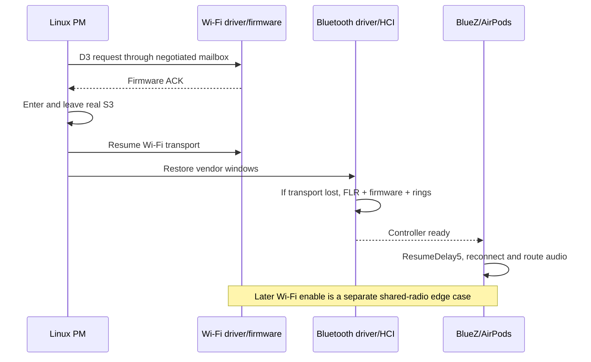

# T2 suspend: issue, implementation and evidence

The driver series enabled real S3 suspend and working Wi-Fi/Bluetooth recovery
on the tested MacBookAir9,1. Repeated automatic AirPods reconnection and audible
stereo playback were confirmed. The latest Wi-Fi-off suspend/re-enable cycle also
passed. Earlier Wi-Fi-off failures and one unexplained reboot remain part of the
record. User accepted the latest functional result and requested consolidation;
no further hardware tests were performed for this integration.

This is S3 support work, not a solution to the original hibernation boot loop.
S4 image writing/restoration has not been validated. Other T2 models, kernel
versions and fresh installation of the new driver package are not qualified.

## 1. Why the old sleep workaround was removed

Stock Wi-Fi failed to acknowledge its D3 suspend request, so the old workaround
unloaded `brcmfmac` around sleep. It bypassed the failing device callback but
introduced radio teardown/reset interactions: Bluetooth could retain a bond or
appear connected while AirPods audio and discovery failed. Without the workaround,
the original suspend abort returned. A bond, a blank screen, or a connected menu
indicator therefore did not prove successful sleep or usable radios.

Commit `12098aec` removed the unload helper and its enabling installation path.
The retirement migration preserves administrator modifications and defers during
an active sleep transaction. This consolidation preserves that removal. The new
approach fixes driver protocol and transport lifecycle rather than reinstalling
the old unload hook. The existing Wi-Fi firmware-stall watcher is a separate
runtime recovery mechanism and remains on the branch.

## 2. Wi-Fi mailbox protocol and startup

Observed BCM4377 firmware advertised protocol7 with shared flags `0x78810007`
and no legacy `USE_MAILBOX` capability. The old host path did not use the required
control-ring mailbox transport for that negotiation. D3 requests timed out and
suspend aborted. The Asahi-derived series selects transport from firmware version
and capability flags, sends initialized little-endian mailbox payloads through
the control ring, and decodes replies through the common handler.

Follow-up patches negotiate host capabilities, establish the correct doorbell
and IRQ/ring-readiness ordering, and prevent reset work from surviving a failed
partial attach. Bounded diagnostic counters preserve visibility into startup.
These startup changes were necessary: early protocol candidates failed to bring
up working Wi-Fi/Bluetooth even before any suspend test. The final protocol
candidate passed actual D3 acknowledgement and ACPI S3 entry.

Source provenance: Hector Martin/Asahi Linux mailbox support, pinned reference
`77cb8f24c2381a8abb7272d7bbdec548d6426a8a`, adapted to the recorded Linux source
baseline. See patch attribution, the source manifest and
[protocol finding](evidence/MAILBOX_PROTOCOL_FINDING.md).

## 3. Bluetooth vendor windows and transport reconstruction

After S3, Bluetooth PCI vendor windows lost their expected values. Restoring
those windows repaired access to the device but did not restore working firmware
rings. The three-patch series therefore:

1. Restores and verifies vendor configuration before ordinary resume access.
2. Stops ring publication when creation fails, preventing further use of an
   incompletely initialized transport.
3. Detects lost transport and lets the HCI core close/reopen the controller around
   explicit Bluetooth function-level reset, firmware boot, RTI setup and ring
   reconstruction. IRQ/DMA guards and retained firmware storage bound failure
   paths; failed initialization must not expose stale buffers to the device.

If Bluetooth was off before sleep, it stays off. Cold reconstruction is deferred
until the user enables it. This passed an initially-off Bluetooth test followed
by successful enable and AirPods audio. No Bluetooth module unload is required.

Bluetooth recovery and Wi-Fi runtime reset are different paths on two functions
of a shared chip. Passing Bluetooth FLR does not establish Wi-Fi FLR safety.

## 4. Automatic AirPods reconnect and audio

Once Bluetooth transport recovery worked, manual reconnect or a case cycle could
restore music, but automatic reconnect still raced controller initialization.
The tested BlueZ `[Policy] ResumeDelay = 5` gives the HCI rebuild time before
reconnect attempts. With the final driver and setting, three consecutive captured
automatic reconnect cycles passed, followed by longer-sleep validation.

Bond preservation, HCI connection completion, PipeWire stereo routing, and the
user hearing playback were checked separately. Earlier transient HCI/profile
errors remain in the records; successful playback does not imply an error-free
journal. This work restores the Bluetooth audio transport. It introduces no new
T2 internal speaker/codec driver patch.

## 5. Wi-Fi off before S3, enabled after wake

This edge case exposed another firmware stall and a possible shared-reset
interaction. One test aborted sleep entirely. Another entered real S3 and
reconnected AirPods while Wi-Fi was still off, then lost Bluetooth after Wi-Fi
was enabled and its watchdog recovery ran. Valid Bluetooth vendor windows did
not trigger the existing window-loss recovery again.

An awake Wi-Fi off/on control passed. Disabling scan MAC randomization for the
specific interface removed one variable but did not solve the S3 case by itself.
The first `toe_ol` firmware query after enable could time out while the driver's
interface-open callback still returned success. The additional Wi-Fi patches:

- Propagate transport errors out of interface open, while preserving the optional
  firmware-rejection fallback (`-EBADE`) for unsupported checksum queries.
- Add an explicit, load-time opt-in function0 FLR recovery path: gate traffic,
  stop IRQ/DMA, save/restore and verify configuration, hold the Wi-Fi CPU, then
  rebuild firmware/rings. A failed stage returns without a shared watchdog or
  bus-reset fallback. Hardware/model checks restrict this experiment.

The first test with this image unexpectedly rebooted after Wi-Fi enable,
according to the user. Its capture was interrupted before trace/report saving;
no pstore fault record or reset-stage proof survived. The subsequent user repeat
passed real S3, Wi-Fi reconnection and AirPods stereo, but **no Wi-Fi runtime FLR
ran**. That functional pass is valid; it does not prove the reset helper repaired
a stall or explain the reboot. Both Wi-Fi patches are included for source
consolidation, with the optional reset status explicit.

## Validation ledger

| Scenario | Result | Qualification |
| --- | --- | --- |
| Normal stock startup, Bluetooth icon, off/on and AirPods audio | Passed previously | Existing automatic Bluetooth installer deployed and stock boot checked |
| Wi-Fi saved-off stock boot, then enable | Passed previously | Existing watcher recovered connectivity in about18sec, one attempt |
| Final S3 driver + ResumeDelay5, three successive auto-reconnect cycles | Passed | Captured automatic connection and user-confirmed playback |
| Longer sleep with Bluetooth on | Passed | Measured778.410sec (12min58.410sec), not15min |
| Bluetooth initially off | Passed | Measured1307.789sec (21min47.789sec); stayed off; later enable/audio passed |
| Awake Wi-Fi off/on | Passed | AirPods audio preserved; Wi-Fi HTTPS204 |
| Earlier Wi-Fi-off sleep | Failed | One abort and one real-S3/re-enable Bluetooth failure |
| First function0-reset candidate test | Failed | User-reported unexpected reboot; fault/reset stage unknown |
| Latest Wi-Fi-off S3/re-enable repeat | Passed | Real S3; enable about4.79sec after PM exit; Wi-Fi activation about2.95sec later; HTTPS204 and active AirPods stereo; no Wi-Fi reset |
| Hibernation/S4 | Unresolved | Test UKIs used `noresume` |

Latest successful boot ID: `ae9bd36d-1ee0-41af-86da-e5e3772f1851`.
Interrupted boot: `439b59fc-6efa-4cc6-ab2f-4a759ef080e3`.
Laboratory outcome commit: `68bf7e0`. No new suspend or reboot was requested
or initiated during consolidation.

## Source integration and installation

[Driver package](../../packages/t2-suspend/README.md) contains the patch order,
pinned hashes, module-only build instructions, tests, and deployment boundary.
The `s3` profile reproduces Wi-Fi source srcversion `16D3C1E5CA6ACF4C3917E4C`'s
build inputs; `wifi-reenable` reproduces `E8C051F8EBDA8DE23852575`'s inputs.
Both use Bluetooth source from `4DF58889A43B9AC7E9E3E8C`'s build.
Those are recorded build identities, not promises that another toolchain emits
identical module bytes.

The consolidated installer now also delivers this driver series automatically through DKMS on the supported MacBookAir9,1. Fresh setup and upgrade migration share a transactional installer, which applies the tested companion configuration and rebuilds the normal T2 boot image. [Automatic installation, update lifecycle, rollback and test boundary](INSTALLATION.md). The tested kernel image remains stock; only the driver modules are rebuilt. No hardware transition was performed to validate this new installer.

Historical [Bluetooth validation](evidence/bluetooth-cold-recovery/VALIDATION.md),
[reconnect timing](evidence/bluetooth-cold-recovery/RECONNECT_TIMING.md),
[Wi-Fi-off investigation](evidence/wifi-off-scan/README.md), and
[Wi-Fi re-enable experiment](evidence/wifi-reenable/README.md) retain earlier
status statements and lab-relative paths. They are evidence snapshots, not
current installation instructions; this document supersedes their old merge gates.
Raw HCI audio, firmware binaries, boot backups and machine configuration were
excluded from the branch.

## Consolidation checks (September12)

Both source profiles applied with zero fuzz and matched every recorded source
hash, including final Bluetooth source. The source-preparation fixtures passed
five publication/drift cases. Extracted-C Bluetooth tests passed configuration,
ring publication, PM gating, IRQ/DMA ordering, firmware-buffer lifetime, ring
reset and PTB retry cases. Wi-Fi interface-open and FLR failure-injection tests
passed. No kernel rebuild or hardware transition was needed for consolidation.

The existing trackpad, T2 hardware, retired-sleep migration, Wi-Fi recovery,
Bluetooth gate and Bluetooth installer shell suites passed. These include31
Wi-Fi Python cases,6 Bluetooth gate cases and17 Bluetooth installer cases.
This verifies preservation of the existing integrations; it is not a fresh ISO
installation or another hardware suspend test.
