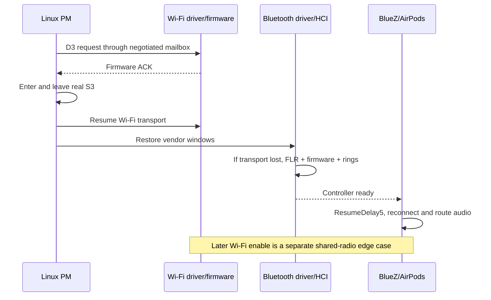

# T2 suspend and hibernation on the MacBookAir9,1: map

This directory documents how suspend (S3) and hibernation (S4) were made to work on the tested MacBookAir9,1 (T2, BCM4377), how that was tested, and how to operate it. This page is the entry point. The S3 driver investigation that used to be the whole of this page follows the map unchanged, from [section 1](#1-why-the-old-sleep-workaround-was-removed) on.

## What works

| Capability | State on the MacBookAir9,1 | Scope |
| --- | --- | --- |
| Suspend (S3) with Wi-Fi and Bluetooth recovery | Works with the DKMS radio package, installed by `omarchy setup t2-suspend` | MacBookAir9,1 with BCM4377 |
| Hibernation (S4) | Works as an opt-in product: ACTIVE on linux-t2 7.2.7, generation `f4025add13d1`, the source image is the Limine default and the stock entry is the fallback. Routine S4 cycle `53ac1f92` reconciled on 2026-09-30 | This exact machine and kernel. Other T2 models are not qualified |
| `omarchy update` with hibernation on | Asks to pause hibernation, runs the update, then offers to resume it or says requalification is needed | MacBookAir9,1 with the opt-in product only |
| Requalification after a kernel update | A tested operator procedure, not yet automated: [REQUALIFICATION.md](REQUALIFICATION.md) | Attended, needs the owner at the machine |

Not proven: other T2 models, a battery-only cycle on 7.2.7, long-term soak, and hibernation on a stock kernel without the private image pair. See [EVIDENCE-7.2.7.md](EVIDENCE-7.2.7.md) for the full list.

## The pieces

- **Drivers:** the S3 series under [`packages/t2-suspend`](../../packages/t2-suspend/README.md) (Wi-Fi mailbox, Bluetooth windows, radio DKMS package) and the hibernation experiment patches 0005 to 0017 on t2bce `6780d522` under `packages/t2-suspend/experiments`.
- **Private boot pair:** a source image and a restore image (UKIs) that keep the production `.linux` and `.cmdline` byte-for-byte and differ only in initramfs contents. Built and staged by `stage-hibernation-uki-pair.py`.
- **Product runtime:** the root-owned runtime under `/var/lib/omarchy/t2-hibernate-product/runtime`, from [`packages/t2-suspend/hibernate`](../../packages/t2-suspend/hibernate/README.md): ledger, pacman guard, and `boot_policy_native.py` with `maintenance`, `assess`, `reactivate` and `rebind`.
- **Desktop integration:** `omarchy system hibernate`, the `omarchy-update-t2-hibernation pre|post` hook in `omarchy update`, and the menu entry.
- **Operator procedures:** [REQUALIFICATION.md](REQUALIFICATION.md) for the new-kernel campaign and [MAINTENANCE-RUNBOOK.md](MAINTENANCE-RUNBOOK.md) for stuck states.

## Reading order

Humans (Omarchy users and maintainers, t2linux contributors):

1. [manual/t2-suspend.md](../../manual/t2-suspend.md) if you only want to use it.
2. [HIBERNATION-OVERVIEW.md](HIBERNATION-OVERVIEW.md): the problem, the design, the safety model and the path to upstream.
3. [HIBERNATION-MECHANISM.md](HIBERNATION-MECHANISM.md): the failure chain and the cold PCI guard, with diagrams.
4. [EVIDENCE-7.2.7.md](EVIDENCE-7.2.7.md): what was run on the hardware, when, with which identifiers.
5. [T2BCE-7.2.7-REBASE.md](T2BCE-7.2.7-REBASE.md) and the experiments README if you want to review or upstream the driver patches.

AI agents and anyone changing the code:

1. [`AGENTS.md`](../../AGENTS.md) hardware safety rules, then [`agents/skills/t2-hibernation.md`](../../agents/skills/t2-hibernation.md).
2. [RESUME.md](RESUME.md): current state (source of truth) and non-repeatable hardware constraints. Reconcile it against `/home/jjc/.local/state/codex-mba-autonomous/handoff.json` and the live boot before acting.
3. [HIBERNATION-GUIDE.md](HIBERNATION-GUIDE.md) (evidence register), [HIBERNATION-PRODUCTION-PLAN.md](HIBERNATION-PRODUCTION-PLAN.md) (requirements), [DEPLOYMENT.md](DEPLOYMENT.md) (runtime gates H0 to H6), [REBIND-DESIGN.md](REBIND-DESIGN.md), [HELPERS-7.2.7.md](HELPERS-7.2.7.md), [AUTOMATION.md](AUTOMATION.md) (unattended reboot loop) and [VALIDATION.md](VALIDATION.md) (S3 installer record).
4. [HIBERNATION.md](HIBERNATION.md) is the historical lab journal. Use it to verify a specific claim, never as a tutorial: older entries describe superseded states.

## Where evidence lives

- In the repository: this directory, [`evidence/`](evidence/README.md) (S3 and radio experiments), and commit messages on branch `fix-t2-vintage-mac-support`.
- On the test laptop only (not in the repository): `~/.local/state/codex-mba-autonomous/` (handoff, per-generation operator scripts and logs; for 7.2.7 under `gen-7.2.7/`), `/var/lib/omarchy/t2-hibernate-product/` (runtime, ledger, archives, retained upgrade files), `/var/lib/omarchy/t2-hibernate-trial/generations/<manifest12>/` (generation trial ledger) and `/var/lib/omarchy-t2-hibernation-pair/` (test_resume and S4 vectors). The `/var/lib` trees are root-owned; read-only `sudo` is enough to inspect them. The private images embed unlock material, so never copy them or their contents into the repository or logs.

## Current status

ACTIVE on linux-t2 7.2.7, generation `f4025add13d1`. The `omarchy update` integration is merged (`8c2b0976`). Next: take draft PRs #1 to #6 out of draft, then upstream the t2bce hibernation patches to linux-t2. Details and the last-known boot are in [RESUME.md](RESUME.md).

The driver series enabled real S3 suspend and working Wi-Fi/Bluetooth recovery on the tested MacBookAir9,1. Repeated automatic AirPods reconnection and audible stereo playback were confirmed. The latest Wi-Fi-off suspend/re-enable cycle also passed. Earlier Wi-Fi-off failures and one unexplained reboot remain part of the record. The automatic installer subsequently passed normal boot and a short S3 cycle with working Bluetooth/audio; see the [deployment validation](VALIDATION.md).

The S3 work below is distinct from the subsequent S4 work. The MacBookAir9,1 hibernation product has completed repeated normal-logind S4 restores: on linux-t2 7.2.6 (including a battery-only cycle) and, after a full requalification, on 7.2.7. Start with the [hibernation overview](HIBERNATION-OVERVIEW.md) and the [7.2.7 evidence record](EVIDENCE-7.2.7.md). The prototype's AC-only admission and blanket package-update block are gone on the current runtime: `omarchy update` pauses hibernation around updates. Other T2 models remain unqualified, and the private image pair is a stopgap until the patches reach linux-t2 upstream.

## 1. Why the old sleep workaround was removed

Stock Wi-Fi failed to acknowledge its D3 suspend request, so the old workaround unloaded `brcmfmac` around sleep. It bypassed the failing device callback but introduced radio teardown/reset interactions: Bluetooth could retain a bond or appear connected while AirPods audio and discovery failed. Without the workaround, the original suspend abort returned. A bond, a blank screen, or a connected menu indicator therefore did not prove successful sleep or usable radios.

Commit `12098aec` removed the unload helper and its enabling installation path. The retirement migration preserves administrator modifications and defers during an active sleep transaction. This consolidation preserves that removal. The new approach fixes driver protocol and transport lifecycle rather than reinstalling the old unload hook. The existing Wi-Fi firmware-stall watcher is a separate runtime recovery mechanism and remains on the branch.

## 2. Wi-Fi mailbox protocol and startup

Observed BCM4377 firmware advertised protocol7 with shared flags `0x78810007` and no legacy `USE_MAILBOX` capability. The old host path did not use the required control-ring mailbox transport for that negotiation. D3 requests timed out and suspend aborted. The Asahi-derived series selects transport from firmware version and capability flags, sends initialized little-endian mailbox payloads through the control ring, and decodes replies through the common handler.

Follow-up patches negotiate host capabilities, establish the correct doorbell and IRQ/ring-readiness ordering, and prevent reset work from surviving a failed partial attach. Bounded diagnostic counters preserve visibility into startup. These startup changes were necessary: early protocol candidates failed to bring up working Wi-Fi/Bluetooth even before any suspend test. The final protocol candidate passed actual D3 acknowledgement and ACPI S3 entry.

Source provenance: Hector Martin/Asahi Linux mailbox support, pinned reference `77cb8f24c2381a8abb7272d7bbdec548d6426a8a`, adapted to the recorded Linux source baseline. See patch attribution, the source manifest and [protocol finding](evidence/MAILBOX_PROTOCOL_FINDING.md).

## 3. Bluetooth vendor windows and transport reconstruction

After S3, Bluetooth PCI vendor windows lost their expected values. Restoring those windows repaired access to the device but did not restore working firmware rings. The three-patch series therefore:

1. Restores and verifies vendor configuration before ordinary resume access.
2. Stops ring publication when creation fails, preventing further use of an
   incompletely initialized transport.
3. Detects lost transport and lets the HCI core close/reopen the controller around
   explicit Bluetooth function-level reset, firmware boot, RTI setup and ring
   reconstruction. IRQ/DMA guards and retained firmware storage bound failure
   paths; failed initialization must not expose stale buffers to the device.

If Bluetooth was off before sleep, it stays off. Cold reconstruction is deferred until the user enables it. This passed an initially-off Bluetooth test followed by successful enable and AirPods audio. No Bluetooth module unload is required.

Bluetooth recovery and Wi-Fi runtime reset are different paths on two functions of a shared chip. Passing Bluetooth FLR does not establish Wi-Fi FLR safety.

## 4. Automatic AirPods reconnect and audio

Once Bluetooth transport recovery worked, manual reconnect or a case cycle could restore music, but automatic reconnect still raced controller initialization. The tested BlueZ `[Policy] ResumeDelay = 5` gives the HCI rebuild time before reconnect attempts. With the final driver and setting, three consecutive captured automatic reconnect cycles passed, followed by longer-sleep validation.

Bond preservation, HCI connection completion, PipeWire stereo routing, and the user hearing playback were checked separately. Earlier transient HCI/profile errors remain in the records; successful playback does not imply an error-free journal. This work restores the Bluetooth audio transport. It introduces no new T2 internal speaker/codec driver patch.

## 5. Wi-Fi off before S3, enabled after wake

This edge case exposed another firmware stall and a possible shared-reset interaction. One test aborted sleep entirely. Another entered real S3 and reconnected AirPods while Wi-Fi was still off, then lost Bluetooth after Wi-Fi was enabled and its watchdog recovery ran. Valid Bluetooth vendor windows did not trigger the existing window-loss recovery again.

An awake Wi-Fi off/on control passed. Disabling scan MAC randomization for the specific interface removed one variable but did not solve the S3 case by itself. The first `toe_ol` firmware query after enable could time out while the driver's interface-open callback still returned success. The additional Wi-Fi patches:

- Propagate transport errors out of interface open, while preserving the optional
  firmware-rejection fallback (`-EBADE`) for unsupported checksum queries.
- Add an explicit, load-time opt-in function0 FLR recovery path: gate traffic,
  stop IRQ/DMA, save/restore and verify configuration, hold the Wi-Fi CPU, then
  rebuild firmware/rings. A failed stage returns without a shared watchdog or
  bus-reset fallback. Hardware/model checks restrict this experiment.

The first test with this image unexpectedly rebooted after Wi-Fi enable, according to the user. Its capture was interrupted before trace/report saving; no pstore fault record or reset-stage proof survived. The subsequent user repeat passed real S3, Wi-Fi reconnection and AirPods stereo, but **no Wi-Fi runtime FLR ran**. That functional pass is valid; it does not prove the reset helper repaired a stall or explain the reboot. Both Wi-Fi patches are included for source consolidation, with the optional reset status explicit.

## Validation ledger

| Scenario | Result | Qualification |
| --- | --- | --- |
| Normal stock startup, Bluetooth icon, off/on and AirPods audio | Passed previously | Existing automatic Bluetooth installer deployed and stock boot checked |
| Wi-Fi saved-off stock boot, then enable | Passed previously | Existing watcher recovered connectivity in about18sec, one attempt |
| Final S3 driver + ResumeDelay5, three successive auto-reconnect cycles | Passed | Captured automatic connection and user-confirmed playback |
| Longer sleep with Bluetooth on | Passed | Measured778.410sec (12min58.410sec), not15min |
| Bluetooth initially off | Passed | Measured1307.789sec (21min47.789sec); stayed off; later enable/audio passed |
| Awake Wi-Fi off/on | Passed | AirPods audio preserved; Wi-Fi HTTPS204 |
| Earlier Wi-Fi-off sleep | Failed | One abort and one real-S3/re-enable Bluetooth failure |
| First function0-reset candidate test | Failed | User-reported unexpected reboot; fault/reset stage unknown |
| Latest Wi-Fi-off S3/re-enable repeat | Passed | Real S3; enable about4.79sec after PM exit; Wi-Fi activation about2.95sec later; HTTPS204 and active AirPods stereo; no Wi-Fi reset |
| Normal boot with automatically installed DKMS drivers | Passed | Corrected firmware packaging; Wi-Fi, Bluetooth and audio confirmed |
| Normal-image short S3 cycle | Passed | Actual S3; Bluetooth recovery and audio confirmed; Wi-Fi interface up, no separate traffic probe |
| Hibernation image write/readback | Passed intended diagnostic boundary | 2,716,000 KiB written and read with the kernel integrity checks before an opt-in stop ahead of memory restore |
| Package 1.5 T2-audio device freeze/thaw | Passed | Patched audio suspended and resumed around the stateful BCE/VHCI sequence; internal input, T2 audio and both radios were available afterward |
| Hibernation memory restore/S4 | Working MBA9,1 prototype; permanent support unfinished | Two normal-logind S4 restores and ordinary source-default boot verified; battery, normal updates and other-model support remain unvalidated |

Latest isolated Wi-Fi-off test boot ID: `ae9bd36d-1ee0-41af-86da-e5e3772f1851`. Interrupted boot: `439b59fc-6efa-4cc6-ab2f-4a759ef080e3`. Laboratory outcome commit: `68bf7e0`. No new suspend or reboot was requested or initiated during consolidation.

## Source integration and installation

[Driver package](../../packages/t2-suspend/README.md) contains the patch order, pinned hashes, module-only build instructions, tests, and deployment boundary. The `s3` profile reproduces Wi-Fi source srcversion `16D3C1E5CA6ACF4C3917E4C`'s build inputs; `wifi-reenable` reproduces `E8C051F8EBDA8DE23852575`'s inputs. Both use Bluetooth source from `4DF58889A43B9AC7E9E3E8C`'s build. Those are recorded build identities, not promises that another toolchain emits identical module bytes.

The consolidated installer now also delivers this driver series automatically through DKMS on the supported MacBookAir9,1. Fresh setup and upgrade migration share a transactional installer, which applies the tested companion configuration and rebuilds the normal T2 boot image. [Automatic installation, update lifecycle, rollback and test boundary](INSTALLATION.md). The tested kernel image remains stock; only the driver modules are rebuilt. The installed-driver normal boot and one short S3 cycle subsequently passed; a clean OS installation remains untested. See the [validation record](VALIDATION.md).

Historical [Bluetooth validation](evidence/bluetooth-cold-recovery/VALIDATION.md), [reconnect timing](evidence/bluetooth-cold-recovery/RECONNECT_TIMING.md), [Wi-Fi-off investigation](evidence/wifi-off-scan/README.md), and [Wi-Fi re-enable experiment](evidence/wifi-reenable/README.md) retain earlier status statements and lab-relative paths. They are evidence snapshots, not current installation instructions; this document supersedes their old merge gates. Raw HCI audio, firmware binaries, boot backups and machine configuration were excluded from the branch.

```mermaid
sequenceDiagram
    participant OS as Linux PM
    participant W as Wi-Fi driver/firmware
    participant B as Bluetooth driver/HCI
    participant Z as BlueZ/AirPods
    OS->>W: D3 request through negotiated mailbox
    W-->>OS: Firmware ACK
    OS->>OS: Enter and leave real S3
    OS->>W: Resume Wi-Fi transport
    OS->>B: Restore vendor windows
    B->>B: If transport lost, FLR + firmware + rings
    B-->>Z: Controller ready
    Z->>Z: ResumeDelay5, reconnect and route audio
    Note over W,Z: Later Wi-Fi enable is a separate shared-radio edge case
```

## Consolidation checks (September12)

Both source profiles applied with zero fuzz and matched every recorded source hash, including final Bluetooth source. The source-preparation fixtures passed five publication/drift cases. Extracted-C Bluetooth tests passed configuration, ring publication, PM gating, IRQ/DMA ordering, firmware-buffer lifetime, ring reset and PTB retry cases. Wi-Fi interface-open and FLR failure-injection tests passed. No kernel rebuild or hardware transition was needed for consolidation.

The existing trackpad, T2 hardware, retired-sleep migration, Wi-Fi recovery, Bluetooth gate and Bluetooth installer shell suites passed. These include31 Wi-Fi Python cases,6 Bluetooth gate cases and17 Bluetooth installer cases. This verifies preservation of the existing integrations; it is not a fresh ISO installation or another hardware suspend test.
