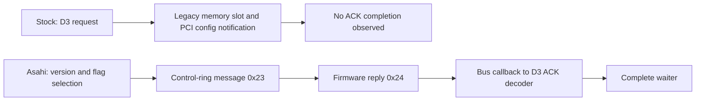

> Historical laboratory snapshot at commit `68bf7e0`. Relative tool paths and earlier next-step/merge statements refer to the lab, not this Omarchy checkout. See `docs/t2-suspend/README.md` for current consolidated status and `packages/t2-suspend/README.md` for runnable source preparation.

# BCM4377 mailbox protocol mismatch — September 11, 2026

## Finding

The stock Wi-Fi driver uses the legacy mailbox path although the running firmware advertises the control-ring alternative used by the reviewed Asahi implementation. This is a concrete missing-protocol candidate for the D3 failure. It is not yet a hardware-validated suspend fix, nor proof that it resolves the separate Bluetooth teardown problem.

## Verified inputs

- Stock kernel: `7.2.4-arch1-Watanare-T2-1-t2`; module srcversion `4C9A066E261416C75B70BB5`.
- Uncompressed installed module SHA-256: `152d6652196464c21048ea03af753f5f0d8b300d1f5a72e9f4af28871f9b1950`.
- Reviewed stable source: `gregkh/linux` tag `v7.2.4`, `pcie.c` and `msgbuf.c`. Installed-module disassembly corroborates the send, wait and ACK-decoding branches.
- Passive live RAM probes: 107 samples confirmed `int_fn0=0`, `int_d2h_db=0xffff`, `mailboxint=0xc30`; 86 additional samples confirmed cached `shared.flags=0x78810007`. No MMIO reads or radio requests were added by these probes. Temporary probe instances were removed.
- Low eight flag bits encode protocol version 7. Bit `0x02000000` is clear. Asahi names this bit `BRCMF_PCIE_SHARED_USE_MAILBOX`; for version >=6, clear selects control-ring mailbox transport.
- Asahi source pinned to `77cb8f24c2381a8abb7272d7bbdec548d6426a8a`; both reviewed files match immutable-commit downloads byte-for-byte. Source copies, hashes and disassembly are retained locally under `mailbox-review/`.

## Stock path and observed failure

`brcmf_pcie_send_mb_data` waits for the old H2D memory slot to clear, writes 1 to that slot, and writes PCI configuration offset 0x98. The routine ignores the PCI write's return status and returns 0. Thus our first-send success never established firmware receipt.

The IRQ thread invokes legacy mailbox decoding only when `status & int_fn0` is nonzero. The live value is zero. The decoder's D3-ACK branch sets `mbdata_completed` and wakes the waiter; this route is therefore unreachable under that register layout. The reviewed stock msgbuf source has no H2D/D2H mailbox-message support.

Our 90-second capture logged 4,742 Wi-Fi IRQ-thread messages, all status 1, and no D2H mailbox decode messages. Normal ring interrupts worked during the capture; this does not establish interrupt health throughout the exact D3 wait. The clean trace showed the first send returned 0, the two-second ACK wait failed, and fallback encountered pending legacy data=1. These observations fit the protocol mismatch.

## Existing implementation to evaluate

Asahi selects mailbox transport from firmware version/flags. With control-ring transport, `brcmf_msgbuf_h2d_mb_write` submits message type 0x23. Incoming type 0x24 dispatches its payload through the bus callback to the common ACK decoder, which completes the D3 waiter. Legacy firmware retains the previous path.

## Next implementation boundary

Review the minimal Asahi protocol-support changes and their dependencies in pcie.c, msgbuf.c, msgbuf.h and bus.h against this exact stock version. Preserve legacy behavior and little-endian payload encoding; check ring reservation failure, send error propagation, and receive processing while the public bus state is DOWN. Do not copy the entire downstream driver: it also contains unrelated reset and platform changes.

No repeated suspend test is needed to rediscover the legacy timeout. The next useful artifact is a narrowly scoped source patch with offline review, not a reconnect script. Hardware deployment requires a separate explicit decision: the user has prohibited more kernel builds. No module, firmware, boot image or consolidated Omarchy source was changed during this review.

## Source links

- [Stock PCIe driver](https://github.com/gregkh/linux/blob/v7.2.4/drivers/net/wireless/broadcom/brcm80211/brcmfmac/pcie.c)
- [Stock msgbuf driver](https://github.com/gregkh/linux/blob/v7.2.4/drivers/net/wireless/broadcom/brcm80211/brcmfmac/msgbuf.c)
- [Pinned Asahi PCIe driver](https://github.com/AsahiLinux/linux/blob/77cb8f24c2381a8abb7272d7bbdec548d6426a8a/drivers/net/wireless/broadcom/brcm80211/brcmfmac/pcie.c)
- [Pinned Asahi msgbuf driver](https://github.com/AsahiLinux/linux/blob/77cb8f24c2381a8abb7272d7bbdec548d6426a8a/drivers/net/wireless/broadcom/brcm80211/brcmfmac/msgbuf.c)

## Implementation update

The [four-file source candidate](mailbox-candidate/README.md) is implemented
and passes offline checks. Review confirmed receive handling remains available
during the D3 wait and identified the required Asahi D0 resume dependency:
private PCIe state must be UP before submitting the control-ring wake message.
The live driver remains stock; hardware validation is pending.
