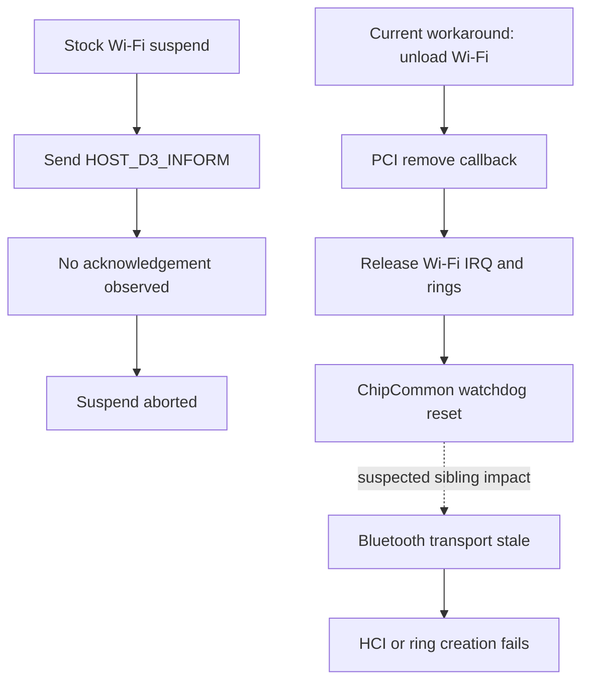

> Historical laboratory snapshot at commit `68bf7e0`. Relative tool paths and earlier next-step/merge statements refer to the lab, not this Omarchy checkout. See `docs/t2-suspend/README.md` for current consolidated status and `packages/t2-suspend/README.md` for runnable source preparation.

# Wi-Fi teardown and Bluetooth transport review — 2026-09-11

## Findings and limits

The installed stock brcmfmac module has no exposed parameter to skip its
teardown reset or its system-suspend D3 handshake (`modinfo -p brcmfmac`).
PCI runtime power/control is already `on`, runtime_status `active`, and
wakeup `enabled`. Changing runtime control to `on` repeats existing state.
The Wi-Fi recovery service logged startup only in the comparison boot;
there is no logged automatic recovery reset explaining that failed attempt.

Current upstream source corroborates the previously recorded 7.2.4 review:

- brcmf_pcie_remove releases IRQ/rings, then calls brcmf_pcie_reset_device.
- reset_device selects ChipCommon and writes watchdog=4.
- brcmf_pcie_pm_enter_D3 sends HOST_D3_INFORM and waits for the firmware
  acknowledgement; missing acknowledgement returns EIO and aborts suspend.
- bcm4377_hci_close destroys HCI rings; hci_open recreates them through the
  existing transport. This is not full firmware/transport reprobe.

This is a mechanism consistent with Bluetooth becoming unusable after Wi-Fi
teardown. It does not establish which hardware resources the watchdog resets,
or distinguish reset from IRQ/ring teardown or reload as the live cause.
Upstream master is supporting evidence, not a byte-identical stock source tree.
No hardware fix is established.

## Rejected substitutions

PCI unbind uses the driver's remove callback too; it is not an alternative
that avoids the reset. Bluetooth power-off/on already failed in the coordinated
test. Extra waits do not reconstruct stale firmware state. Removing the hook
alone failed both deep and s2idle on stock. Do not unload Bluetooth/T2 drivers
or silently suppress a failed D3 callback.

## Next investigation boundary

Focus on the original Wi-Fi D3 acknowledgement failure, not more reconnect
hooks. Before another transition, inspect the installed firmware/NVRAM
provenance and prepare bounded mailbox/firmware-console diagnostics using the
stock driver's existing facilities. Distinguish failure to send, missing
firmware acknowledgement, and failure to service the interrupt. The watchdog
hypothesis remains separate until observed across an isolated operation.
No radio cycle, PM transition, module build or installed change was made in
this review. Original sleep workaround remains installed.

## Sources

- https://raw.githubusercontent.com/torvalds/linux/master/drivers/net/wireless/broadcom/brcm80211/brcmfmac/pcie.c
- https://raw.githubusercontent.com/torvalds/linux/master/drivers/bluetooth/hci_bcm4377.c
- ../COORDINATED_RADIO_724.md (actual ordering-test failure)
- ../BLUETOOTH_REOPEN_724.md (prior transport traces)
- README.md (stock comparison, actual sleep abort)

## Follow-up: failure precedes D3

The stock comparison journal records two `brcmf_msgbuf_delete_flowring`
TX-status timeouts at 16:04:46, while NetworkManager processes its sleep
notification and disconnects Wi-Fi. Kernel suspend begins at 16:04:47;
D3 fails later. This is temporal evidence, not proof that disconnect causes
the D3 failure. The earlier statement that only unloading matters is too strong.

Installed firmware reports 16.20.371.0.3.6.125, FWID 01-52f5532e, dated
2023-07-08. Available Apple board files include fiji/formosa/tahiti variants;
the inspected normal boot log does not identify the exact NVRAM file selected.
No firmware replacement is justified by its age alone. Existing module config
is feature_disable=0x82000; it was not changed.

`capture-mailbox.py` is a bounded passive trace (1..180 seconds). It records
entry into disconnect/ring teardown/reset/mailbox/PM functions, mailbox send
argument and return, D3 return, and available PM tracepoints. It never calls
NetworkManager mutation, Bluetooth mutation, modprobe, or a PM transition.
Per-CPU loss statistics and kernel journal are preserved with private permissions.
It removes only its own probes and instance, including on ordinary interruption.
An uncatchable SIGKILL still requires manual cleanup of its t2mb_<pid> events.
It does not read firmware ACK contents or prove interrupt delivery.

Validation: syntax check plus real two-second passive setup/cleanup smoke test
passed on stock; archive /var/log/stock-mailbox-4g18emir, no cleanup errors.
No radio or power transition was requested during validation.

Next controlled operation: capture an ordinary Wi-Fi disconnect/reconnect with
both drivers remaining loaded, while AirPods playback provides a Bluetooth
control. Save original connection UUID first and restore it with a bounded
NetworkManager call. Check delayed Bluetooth health and flowring errors.
Stop on failure; do not automatically escalate to unload or suspend. This
operation has not yet been run. The passive capture is prepared, not a fix.

## Disconnect-only result — 16:31, same stock boot

One explicit NetworkManager disconnect/reconnect completed. Both drivers stayed
loaded. Wi-Fi reactivated the original connection in about four seconds from
test start. AirPods Connected remained true after the 60-second capture; later
PipeWire readback still showed active stereo streams routed to AirPods.
User subsequently confirmed uninterrupted audible playback; the disconnect-only control passed.

Trace captured cfg80211 disconnect returning 0, followed by flowring deletion.
One txstatus timeout occurred; no reset-device, mailbox-send or D3 probe event
occurred. No HCI error was logged in the capture interval. Per-CPU trace loss
and overrun counters were zero; cleanup succeeded. This shows the flowring
warning can occur without the persistent Bluetooth failure. It does not prove
that this warning is harmless in every context, or prove the watchdog cause.

Evidence: /var/log/wifi-disconnect-only-fep4hkk7/events.jsonl and
/var/log/stock-mailbox-1i6ya2xn/{trace.txt,report.json,cpu*-stats.txt}.
No suspend, Bluetooth power operation, driver unloading, or recovery reset was
requested by the runner. Its per-boot claim is consumed; do not rerun it.

## D3 capture preparation

Added optional `--pcie-debug` to capture-mailbox.py: save the existing driver
mask, add PCIe bit 0x80000, and restore the exact prior value on exit. A private
capture lock excludes overlapping runs of this tool. Two-second live passive
validation /var/log/stock-mailbox-agujgbpv confirmed actual PCIe interrupt/ring
messages, cleanup without errors, and mask restored from 524288 to 0.
This logging can affect timing and is bounded; it is not a driver fix.

arm-d3-capture.sh prepares a runtime-only override bypassing Wi-Fi unloading
and runs that passive capture for 90 seconds. It never initiates suspend.
Its EXIT cleanup removes only its own override and reloads systemd; reboot
also clears the runtime override. Bash syntax validation passed. The wrapper
has not been executed or tested across an actual transition. User must wait
for 'Passive capture active' before one manual suspend; after return, preserve
the logs and do not repeat the test. Expected failure remains possible.

Upstream lead (not deployed): Sebastian Reichel's 2026-09-08 proposal tolerates
D3 ACK timeout without WoWL on BCM43752/Rockchip, relying on power-off/reprobe.
It does not establish BCM4377/T2 shared-Bluetooth safety, and it changes kernel
code. This is not a userspace setting or a justification for a new kernel build.
https://lkml.iu.edu/2609.1/02161.html

## Callback ordering and next clean capture

Review of the retained fallback trace shows bcm4377's PCI bus suspend callback
completed at 127.296251, immediately before Wi-Fi's callback at 127.296254.
The mailbox send then returned -5 against pending data=1. This establishes
fallback ordering only; the first attempt was overwritten. Generic earlier
prepare callbacks are not the actual bus suspend callbacks. Ordering alone
does not establish shared-hardware interference.

The upstream BCM4377 suspend implementation quiesces Bluetooth after HCI
suspend. This makes sibling ordering a concrete hypothesis to measure, not a
reason to reorder live devices or unload Bluetooth.
https://lists.infradead.org/pipermail/linux-arm-kernel/2022-November/787073.html

The corrected capture now probes bcm4377_suspend/resume entry and return
alongside the Wi-Fi callbacks, uses mono timestamps, and avoids all-device
callback noise. Two-second passive validation passed on stock with cleanup
errors empty: /var/log/stock-mailbox-5rpc5clj. The old workaround remains
disabled with no sleep.target requirement. No new transition initiated.

Next hardware capture must begin from a fresh stock boot: the current boot
already encountered a pending mailbox after failed sleep, so it cannot
establish the first-attempt behavior. After confirming Wi-Fi and AirPods
playback, use capture-mailbox.py directly for one manual suspend attempt.
Do not run arm-d3-capture.sh or re-enable the retired helper. No kernel build
or firmware replacement is authorized by this diagnostic preparation.
