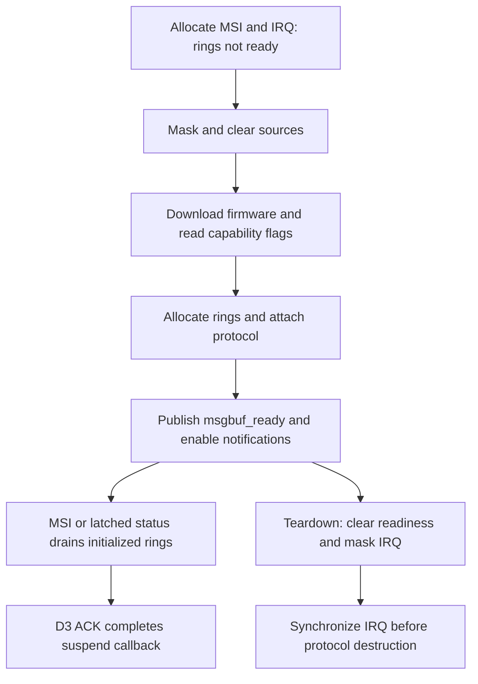

> Historical laboratory snapshot at commit `68bf7e0`. Relative tool paths and earlier next-step/merge statements refer to the lab, not this Omarchy checkout. See `docs/t2-suspend/README.md` for current consolidated status and `packages/t2-suspend/README.md` for runnable source preparation.

# Complete mailbox/IRQ candidate: implemented and compiled

Status: source implementation and driver-only build pass offline checks.
Not installed, booted, or hardware validated. The running stock-control boot
and all installed boot artifacts remain unchanged by this work.

## Patch series

Apply patches 0001 through 0004 in order to the pinned v7.2.4 source. Patches
1–2 are retained as historical components; do not deploy either alone again.

1. Control-ring mailbox request/reply support and D0/D3 submission ordering.
2. Host-capability negotiation for the selected modern transport.
3. Required IRQ, doorbell, and startup dependencies, with explicit lifetime rules.
4. Independent guard for reset-work cancellation after partial attach failure.

Patch 3 adapts the reviewed
[Asahi PCIe implementation](https://github.com/AsahiLinux/linux/blob/77cb8f24c2381a8abb7272d7bbdec548d6426a8a/drivers/net/wireless/broadcom/brcm80211/brcmfmac/pcie.c).
It is not a wholesale downstream driver replacement. The implementation retains
the existing reset algorithm, firmware format, and other device drivers.

## Interrupt contract

MSI delivery requests a ring drain even if firmware has cleared mailbox status.
A shared legacy interrupt with zero status still returns IRQ_NONE. The hard IRQ
atomically accumulates sampled status; the thread consumes it together with the
current hardware status. This preserves legacy mailbox and ring notifications
when status clears between handlers.

`msgbuf_ready` is published with release semantics from bus preinit, after the
protocol/rings are initialized. The IRQ thread loads it with acquire semantics.
Temporary interrupt masking does not change this flag. The thread accesses rings
only while this flag is true and private PCIe state is UP. Thus startup MSI can
be acknowledged before msgbuf exists, and public-bus quiescing still permits D3
ACK receipt until private PCIe state becomes DOWN.

On bus stop, readiness is cleared, interrupts are masked, and `synchronize_irq`
drains an already-running handler before protocol teardown. A second mask write
covers a handler that unmasked while stopping. IRQ release similarly closes the
gate and calls `free_irq` before final masking and disabling MSI. The flag is not
a substitute for synchronization; both are necessary for object lifetime.

## Register mapping and firmware startup

PCIe accesses now use the fixed enumeration aperture at BAR0 + 0x2000. Stock
already maps 32 KiB and defines this aperture. Only PCIe registers use it;
backplane and chipcommon access still use the movable selected-core window.
This is a necessary companion to enabling IRQ before firmware download: an IRQ
must not accidentally read a different core's register while setup moves BAR0.

For control-ring firmware, H2D and host-ready notifications select the DAR or
non-DAR registers from the firmware flag. Legacy mailbox firmware retains its
existing register selection. Host capability DAR is advertised consistently
when firmware requests it; this host's observed flags have DAR clear.

MSI/IRQ is requested before firmware download. If that request fails, the still
owned firmware/NVRAM buffers are released before normal failure cleanup.
Before firmware release from reset, interrupt sources are masked/cleared using
Asahi's register sequence, including PCI config interrupt mask and TLCNTRL_5.
Ring readiness stays false throughout download and allocation.

## Partial attach cleanup

The observed warning came from `cancel_work_sync` on a work item whose
initialization had not been reached. Patch 4 uses the same `bus_reset.func`
check already used by reset scheduling, under the same bus mutex. Initialized
work is still cancelled synchronously. No warning is suppressed, no function
pointer is fabricated, and successful-attach scheduling is unchanged.

## Verification

- All four patches apply with `git apply --whitespace=error`.
- `protocol-sources.json` pins the resulting pcie.c and core.c hashes.
- `verify-protocol.py` executes extracted candidate IRQ/doorbell functions with
  mocked register access. It passes 32 combinations of MSI/legacy delivery,
  readiness, private state, initial status, and threaded status. It also tests
  legacy mailbox status retention and modern/legacy DAR register selection.
- Extracted cancellation code passes null-driver, uninitialized-work and
  initialized-work cases with mutex and cancellation assertions.
- Source checks verify fixed-aperture access, IRQ-before-download ordering,
  firmware ownership cleanup, readiness publication, and synchronization before
  protocol destruction.
- The C fixtures compile with warnings-as-errors and UBSan. They are behavioral
  models of driver code, not real interrupts, DMA, firmware, or CPU races.
- Full brcmfmac and three vendor-companion module compilation, MODPOST, linking,
  and BTF generation passed against the installed stock kernel headers. No
  whole-kernel build occurred.

Build: `build-protocol.sh`; test: `verify-protocol.py`.
The build intentionally refuses to overwrite an existing work/protocol tree.
Outputs: `work/protocol/`; log: `work/protocol-build.log`.
Main module srcversion: `2176591632CAEC44FAA87BC`.
Module hashes/vermagic: `protocol-driver-build.json`.

## Remaining hardware boundary

The control proved the early-loading image can boot packaged stock successfully.
This complete protocol candidate has not been packaged into a boot image yet.
Prepare a distinct, rollback-safe image using these exact module hashes and the
same validated loading arrangement. Preserve the stock-control and normal-stock
paths until candidate boot health is established. Add bounded initialization
observability before asking for a boot: firmware flags, selected doorbells, MSI
mode and handled-vs-drained interrupt counters are the useful evidence if it
fails. Do not enable an unbounded per-IRQ log flood.

Only after clean boot initialization without a recovery reset, functioning
Wi-Fi/AirPods, and no controller timeouts should a captured suspend/wake test
be requested. No claim of a fixed suspend or hibernate is justified yet.
