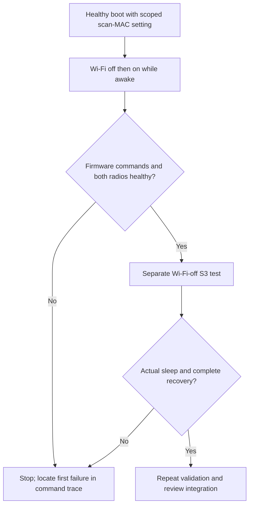

> Historical laboratory snapshot at commit `68bf7e0`. Relative tool paths and earlier next-step/merge statements refer to the lab, not this Omarchy checkout. See `docs/t2-suspend/README.md` for current consolidated status and `packages/t2-suspend/README.md` for runnable source preparation.

# Inactive Wi-Fi MAC-programming experiment

Status: awake off/on passed; Wi-Fi-off S3 entry passed, but post-wake Wi-Fi enable FAILED.
This is a single-variable experiment, not a proven suspend repair. Consolidated
Omarchy branch remains unchanged and merge remains blocked by cycle8.

## Evidence and hypothesis

Cycle8 in ../bluetooth-cold-recovery/VALIDATION.md never reached actual sleep.
Wi-Fi flow-ring deletion timed out at monotonic2053.016/2053.110. NetworkManager
then reported successful assignment of a scanning MAC at2053.479 while Wi-Fi
was blocked. On the suspend request, its attempt to restore the permanent MAC
failed at2080.506, before kernel PM entry2080.610. Firmware could not acknowledge
either the deep or subsequent automatic s2idle D3 request. Later, re-enabling
Wi-Fi caused the existing recovery watcher to reset its firmware; networking
returned but Bluetooth was unhealthy.

The historical saved-off boot (linked below) also programmed a scanning MAC before the later firmware
command stall. This correlation does not establish causation. Flow-ring
timeouts precede the successful MAC change in cycle8; autonomous firmware
power management, earlier S3 state, or disconnect handling remain alternatives.
The older MPC interception candidate already failed its saved-off boot test;
repeating that policy without new evidence is not justified.

The test suppresses NetworkManager's scan-time MAC changes for this adapter,
removing the inactive-interface MAC programming and subsequent restoration as
potential triggers. A clean off/on cycle will narrow the diagnosis; it will
not by itself prove initially-off suspend or saved-off boot fixed.

References: [previous MPC failure](../../wifi-driver/FAILED_OFF_BOOT.md),
[NetworkManager configuration reference](https://networkmanager.dev/docs/api/latest/NetworkManager.conf.html).
The documented `wifi.scan-rand-mac-address=no` leaves the current scan address
unchanged. Connection profiles retain their own MAC policy. This reduces scan
address privacy for the tested adapter and persists on stock boot too until
removed. It does not force rfkill on, associate with a network, or reset firmware.

## Installed change and verification

`/etc/NetworkManager/conf.d/99-t2-radiooff-scan-test.conf` matches only
`interface-name:=wlp115s0f0`. The installer checks MacBookAir9,1 and PCI14e4:4488
at73:00.0 with that interface present. It exclusively creates the file, refuses
changed content/symlinks, and runs the installed NetworkManager1.58.1-1 parser.
No prior file was replaced. SHA256:
`d1f2bfe91fda893ed1edc4dae2f52121eb03bb985daf044e9d13a6be05949106`.

Preparation and post-install effective configuration parsing both passed with
no parser warnings. Networking was not restarted or reloaded: the running
daemon is not claimed to have adopted the setting yet. It will load on the next
normal boot. No kernel/module/boot artifact changed.

`../capture-mailbox.py --wifi-control` now records firmware command number,
length, direction, iovar names, return values, and interface/MAC setter calls.
It records no firmware-command payloads, MAC setter buffers, keys, or packet
contents. Existing optional btmon still has its separate private raw-data limits.
Five-second passive live registration/capture/cleanup passed on the current
candidate: `/var/log/stock-mailbox-_orhoiyj`, cleanup_errors=[]. This checks probe
installation and cleanup, not that a radio transition is healthy. Python syntax
and git diff whitespace checks passed.

## Next hardware sequence

1. User boots the same **T2 radio recovery test (Bluetooth FLR)** with Wi-Fi
   enabled, restoring a healthy baseline after cycle8's Bluetooth failure.
   Agent initiates no power transition. Verify actual new boot/module identities,
   effective NM setting, AirPods audible audio, and real Wi-Fi traffic first.
2. Arm a bounded passive capture with `--candidate --wifi-control --pci-config
   --bluetooth-monitor --seconds 180`. Do not arm before the user is ready.
3. User turns Wi-Fi off for60sec while remaining awake, then on. Verify no
   new scanning-MAC change, command timeout, watchdog recovery, lost AirPods audio,
   or failed actual Wi-Fi traffic. A service reset is a failed gate even if
   networking eventually returns. No suspend in this first diagnostic cycle.
4. Only after that passes, capture initially-off Wi-Fi suspend separately.
   Verify actual S3 time, off-state preservation, D3 ACK, Bluetooth audio, and
   subsequent Wi-Fi traffic without a firmware reset.



## Rollback

Run the exact-content-checked removal:

```sh
pkexec /usr/bin/python3 /home/jjc/Projects/MBA_9_1/hibernate_test/v2/stock-resume/wifi-off-scan/manage.py remove
```

The next NetworkManager start uses the prior configuration again. If removing
after the daemon adopted the setting, a deliberate configuration reload can be
used after checking live state; the manager never restarts networking itself.
Raw captures remain private; no source changes have been merged into Omarchy.

## First awake off/on result

Boot a1706313-8a8b-4dba-9271-254d236a26a4, same candidate module identities.
User confirms AirPods audio still works. Read-only post-test checks confirm
existing AirPods bond, Connected=yes, active cliamp stereo to AirPods, actual
Wi-Fi HTTPS204 and unchanged interface index2. Recovery watcher remains at
attempts0, with no reset recorded by its journal or the driver trace.

Private capture /var/log/stock-mailbox-pkcch94t completed: 962/962 entries,
713 PCI/rfkill samples, no dropped events or overruns on all four CPUs,
no capture error, cleanup_errors=[], btmon exit0. No sleep occurred.
First blocked sample179.695, first unblocked sample229.972 (~50.277sec between
samples). NM disable179.994/enable229.810; do not claim the requested60sec.
NM reports successful activation232.789, about3sec after enable.

Trace records netdev stop179.487 and open229.810, no primary
brcmf_c_set_cur_etheraddr call and no watchdog reset. No scanning-MAC change
appears in NM's journal. No firmware query/flow-ring/HCI timeout or trap appears
in the inspected boot log. Bluetooth vendor windows remain unchanged.

Negative firmware replies remain visible: tdls_sta_info=-52 before and after
the toggle, plus toe_ol, p2p_disc and p2p_da_override=-52 during enable.
P2P setup warnings also occurred at initial boot. These are returned firmware
errors, not missing replies; this result is functional success with retained
feature diagnostics, not an error-free firmware claim. Preserve these findings
for final review instead of broadly ignoring negative results.

This test supports proceeding to the separate initially-off Wi-Fi S3 case.
It does not prove the scan-MAC change caused the improvement: earlier history
also contains successful awake off/on cycles on another driver baseline, and
cycle8 followed multiple S3 cycles. No new power transition or driver change
was made. Arm a new capture only when the user is ready for the S3 sequence.

## Wi-Fi-off S3: entry passes, post-wake enable fails

Same boot a1706313-8a8b-4dba-9271-254d236a26a4. Archive
/var/log/stock-mailbox-sl2a5nb2: 1376/1376 trace entries,696 PCI samples,
34.081sec actual sleep, zero drops/overruns on all four CPUs, no capture error,
cleanup_errors=[],btmon exit0. This was actual ACPI S3, not another abort.

User reports hearing the AirPods reconnect sound with Wi-Fi still off, then
losing the connection after enabling Wi-Fi. Case cycling occurred AFTER that
loss. This does not invalidate the earlier automatic-reconnect observation;
subsequent connection behavior is not an uncontaminated automatic-retry test.
User also reports normally visible Bluetooth discovery devices missing.

Trace chronology (monotonic seconds, independent of deferred journal printing):

- Wi-Fi first sampled blocked471.644; flow-ring TX-status timeout also logged
  at471.644. Keep this anomaly visible despite successful S3 entry.
- D3 request488.871429, firmware ACK488.877151 (about5.7ms).
- D0 INFORM491.829000 after real S3. Kernel records BT window restoration,
  queued HCI recovery, FLR492.287377 and firmware/RTI ready493.008452.
- HCI capture-relative Controller Resumed85.421894, host Create Connection
  90.598225, Connect Complete Success93.971234, locally initiated MGMT Device
  Connected93.992734. This verifies automatic reconnect before Wi-Fi enable,
  independently of the later case cycling. User heard its reconnect sound;
  continuous audible music during the Wi-Fi-off period is not separately proven.
- Wi-Fi enabled509.632455 in NM journal (about16.5sec after PM exit, not the
  requested30sec). First reopened-interface firmware query is toe_ol at
  509.632544; it returns -5 at511.674065 after a missing response. Further
  power/multicast commands time out. A first-command failure does NOT prove
  the enable operation itself caused the stall: firmware may already have
  become unresponsive during resume or the Bluetooth FLR.
- Watcher RESET_BEGIN520.092960; console dump contains firmware TRAP4 at
  PC1b7dde (same signature as cycle8). Watchdog reset trace521.979043.
  Watcher RECOVERED526.233277, netdev index2 replaced with5; live Wi-Fi HTTPS204.
- Bluetooth opcode0x202d timeout logged534.395 and repeatedly afterward,
  then link TX timeout570.008. Live AirPods Connected=no, bond preserved.
  All sampled BT vendor windows remain valid, including across Wi-Fi reset.

The first radio failed before the Wi-Fi recovery reset; resetting Wi-Fi then
preceded Bluetooth controller timeouts. This sharpens the cross-function reset
hypothesis, but does not independently prove its mechanism. Missing discovery
is consistent with HCI command failure, not evidence of erased AirPods bonds.
Do not use repeated scans, pairing deletion, or case cycling as the repair.

Outcome: entry and pre-enable BT automatic reconnect succeeded; full radio
recovery FAILED. The scan-MAC setting is insufficient as a fix, and one changed
outcome does not prove its causal role in allowing S3. Keep it as the current
experimental baseline pending the next targeted comparison. No merge.

Next investigation: inspect Wi-Fi D0/firmware state before the first netdev open,
including whether Bluetooth's recovery FLR affects an inactive Wi-Fi function;
review the later Wi-Fi watchdog reset's scope and BT transport-loss detection.
The latter currently relies on vendor-window loss, which is absent here.
Do not repeat this unchanged S3 test. No agent power transition, reset, radio
command, or driver/configuration change was made while reviewing this failure.
