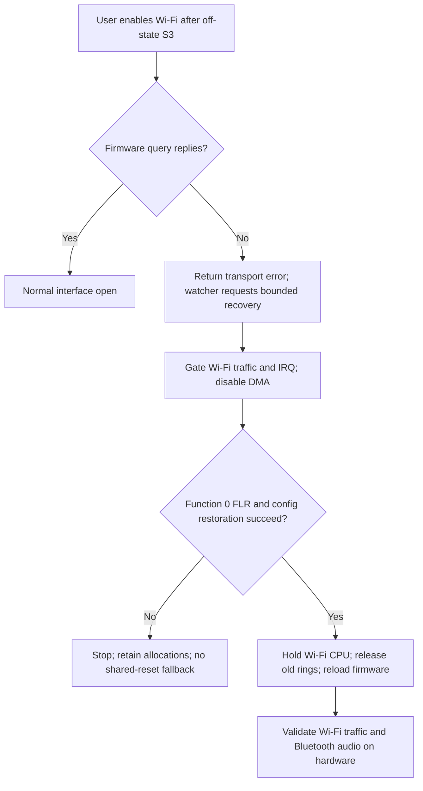

> Historical laboratory snapshot at commit `68bf7e0`. Relative tool paths and earlier next-step/merge statements refer to the lab, not this Omarchy checkout. See `docs/t2-suspend/README.md` for current consolidated status and `packages/t2-suspend/README.md` for runnable source preparation.

# Target: enable Wi-Fi after sleeping with Wi-Fi disabled

User explicitly narrowed the next repair boundary to this sequence. Preserve
working Wi-Fi-on S3 and the successful awake off/on case; do not divert to
AirPods pairing, global Bluetooth timing, or another generic suspend workaround.

## Confirmed false success on re-enable

Both captured ndo_open calls return0, but their behavior differs:

| Capture | Open entry/return (monotonic sec) | First firmware query |
| --- | --- | --- |
| Awake toggle, pkcch94t | 229.809832 / 229.813780 | TOE rejection -EBADE; transport replied |
| Post-S3 enable, sl2a5nb2 | 509.632538 / 511.674073 | TOE response timeout -EIO |

In core.c, brcmf_netdev_open treats every toe_ol error as optional checksum
absence, then calls cfg80211_up. In cfg80211.c, brcmf_config_dongle returns0
immediately when cfg->dongle_up remains true. Thus a lost transport can be
advertised as successful interface open. Later configuration commands time out
and the installed recovery watcher initiates a ChipCommon watchdog reset.
Bluetooth controller timeouts follow that reset in the failing capture.

The reproduction sequence is established. Exact firmware failure timing and
cross-function reset mechanism remain unproven; do not confuse those questions
with uncertainty about which user sequence must be fixed.

## First repair component

0001 propagates negative TOE-query transport errors from ndo_open. It preserves
-EBADE, which this FWIL implementation uses for a returned firmware rejection,
and therefore preserves the successful optional-feature fallback. No firmware
reset, radio toggle, module unloading, or change to PM callbacks is introduced.

The actual patched function passed extracted C tests with warnings-as-errors
and UBSan: EIO/ETIMEDOUT/ENOMEM/EBADF failures stop before cfg80211_up; EBADE
allows open without checksum; successful checksum on/off, cfg failure and bus
down retain expected behavior. Patch applies with zero fuzz. The combined candidate now also passes a W=1 Wi-Fi module build; hardware
validation remains pending. Prior source/build artifacts and the running driver
are unchanged.

This patch alone does NOT fix firmware recovery. The watcher can still react
to the logged timeout and reset Wi-Fi. Do not install it as a complete fix or
request another user reboot/suspend solely to test an error return.

## Remaining repair boundary

Trace/restore command transport for the first open after off-state S3 before
claiming successful enable. Preserve the disabled preference until the user
actually enables Wi-Fi. A recovery mechanism must not silently kill the working
Bluetooth sibling. The present Wi-Fi reset writes the ChipCommon watchdog;
BT's transport-loss predicate only observes changed vendor PCI windows, which
remain valid during the later failure.

Next implementation must establish how to restore Wi-Fi transport at this
boundary and either avoid the disruptive reset or coordinate its effects with
Bluetooth safely. Do not simply ignore the toe_ol timeout, force Wi-Fi on during
sleep, increase ResumeDelay, or trigger repeated reset/reconnect loops.

Validation requires the exact previously failing sequence, actual network
traffic, automatic AirPods recovery/audio and discovery health, plus repeat
awake off/on and Wi-Fi-on S3 controls. Case cycling after the prior failure
must not be counted as automatic recovery. No merge until this gate passes.

## Function-level recovery candidate

A bounded RAM-only probe, verified against the loaded module's DWARF offsets
and SHA256, found ChipCommon core0x800 revision64 and PCIe core0x83c revision64.
The pinned Asahi reset-mask path requires ChipCommon>=65, so blindly importing
it would retain the legacy watchdog on this machine. PCI sysfs advertises
`flr bus`; this candidate explicitly chooses FLR and never asks the kernel to
select an alternate reset method. Reference implementations:
[Asahi reset](https://github.com/AsahiLinux/linux/blob/77cb8f24c2381a8abb7272d7bbdec548d6426a8a/drivers/net/wireless/broadcom/brcm80211/brcmfmac/pcie.c)
and local mailbox-review/stock-pci-core.c (pcie_reset_flr).

0002 adds load-time opt-in `brcmfmac.t2_recovery_flr=1`. Only runtime recovery
changes: initial probe keeps its existing reset behavior. The new path requires
MacBookAir9,1, Apple DMI, BCM4377 chip, Wi-Fi PCI14e4:4488 function0 and ARM CR4.
It probes FLR support, gates bus/ring traffic, removes the IRQ handler, disables
bus mastering, saves PCI/vendor configuration and requests explicit function0
FLR. It restores and checks vendor configuration with DMA still off, then holds
the Wi-Fi CPU in reset for the existing firmware download path. Only then can
old DMA ring storage be released and firmware rebuilding begin. This deliberately
does not assume PCI FLR also halted the Wi-Fi firmware CPU.

A failed quiesce/reset/configuration/CPU-stop returns an error with DMA disabled
and retained allocations; it never invokes the shared watchdog as a fallback.
After this recovery path is selected, later teardown also skips the watchdog.
The existing watcher owns the bounded reset request and reconnection observation;
it is unchanged. The patch does not touch the Bluetooth driver or force Wi-Fi on.
This is recovery from a firmware stall, not proof of preventing that stall.
Whether function0 reset and Wi-Fi CPU initialization preserve Bluetooth on this
hardware is precisely the next experiment, not a fact established by PCI naming.

### Validation and identity

- Actual reset helper: injected FLR support/execute, PCI save/read/write/readback,
  all-ones configuration, CPU-stop and hardware-guard failures pass. Assertions
  cover DMA/IRQ order and lock release. C fixture uses warnings-as-errors/UBSan.
- Existing ndo_open failure tests pass; both patches apply with zero fuzz.
- W=1 build completes for brcmfmac and its three vendor companions without
  warnings/errors. No whole-kernel build. Checkpatch0002:0 errors/0 warnings.
- Installer tests cover installation, unchanged stock/default, rollback, drift
  rejection and failed menu write cleanup in a temporary filesystem.
- Image preparation verifies extracted module hashes, unchanged Bluetooth,
  stock kernel hash, command line and complete /boot manifest preservation.

Main module SHA256 c11e5a2df3c613fd5b6c283a6a3ec2b5fbcb2815587b293ce9192035ded8e25a;
srcversion E8C051F8EBDA8DE23852575. Module identities are in modules.json.
UKI SHA256 bf76b7c6d08b0f5e8af494f384c2d21170a8aa118aa5211bd8c33a653650f165.
Private image/backup/proof: work/boot-reenable/ (root-owned, excluded from Git).

### Boot and hardware gate

Separate entry: **T2 Wi-Fi re-enable test (function reset)**,
/boot/t2-wifi-reenable/candidate.efi. Stock remains default; prior test image is
preserved. No automatic reboot/suspend/hibernate is authorized or initiated.
On user boot, first run verify-running.py, check actual traffic and audible
AirPods, and verify no startup recovery or new timeout. Keep Wi-Fi enabled for
this initial boot; do not combine boot verification with a suspend test.

Only after clean boot, capture the exact failure sequence with
capture-mailbox.py --candidate --wifi-control --pci-config --bluetooth-monitor.
The updated capture recognizes the new module manifest and adds the FLR callback.
Verify that any recovery logs function0 FLR and CPU-held success, Wi-Fi actually
passes traffic, and AirPods remain usable without case cycling or manual repair.
A successful recovery experiment is not a clean no-stall/no-reset suspend pass:
record the initial timeout and recovery latency honestly. Stop on failed FLR,
Bluetooth loss, missing devices, or failed network traffic; do not retry blindly.

Rollback uses deploy-boot.py remove, which checks the exact owned image/menu
before removing this entry only. Boot stock or the preceding candidate first.
Scoped scan-MAC configuration has its own rollback in ../wifi-off-scan/README.md.
No consolidated-branch merge until hardware recovery and regression review pass.

Installation and post-install verification completed: new image hash, original
menu/default and every pre-existing /boot file match their expected values.
Exact two-patch application reproduces both compiled changed source files.
Hardware outcome remains pending. No transition was initiated during deployment.

### Fresh boot baseline (2026-09-12)

Boot `439b59fc-6efa-4cc6-ab2f-4a759ef080e3` passes verify-running.py,
including the new module identity and loaded FLR option Y. Wi-Fi HTTPS204,
AirPods Connected=yes with active cliamp stereo and user-confirmed music.
No failed units, startup firmware/HCI timeout, or recovery attempt; known
P2P -52 setup warnings remain. Deep sleep selected, pm_test none, old unload
hook inactive. Runtime function-reset behavior remains untested.

Capture preflight found the compiler inlined brcmf_pcie_recovery_flr.
The capture now probes its existing brcmf_pcie_reset caller and return;
explicit kernel stage messages identify FLR/CPU-held success. The failed
preflight exited before installing probes or starting monitors. No driver
change or rebuild was needed.

## Hardware results: interrupted test and successful repeat

Current boot ae9bd36d-1ee0-41af-86da-e5e3772f1851 passes candidate verifier.
User repeated Wi-Fi OFF -> suspend -> wake -> Wi-Fi ON and reports Bluetooth
working and music audible. Journal confirms Wi-Fi off155.922, deep entry164.655,
ACPI S3 entry/wake, Bluetooth FLR168.369 and firmware/RTI ready169.102,
PM exit169.191, Wi-Fi on173.980 (~4.79sec after PM exit, not the prescribed30sec).
Read-only checks: Wi-Fi HTTPS204; AirPods Connected=yes, active cliamp stereo.
No Wi-Fi runtime FLR/recovery-start message or firmware query timeout in this
boot inspection. Therefore this is a successful functional cycle, NOT validation
of the new Wi-Fi recovery helper. Pre-suspend flowring TX-status timeout and
transient Bluetooth -5 resume errors remain in logs; Bluetooth rebuild succeeds.
No full capture was armed for this user-initiated repeat. Do not invent duration
or claim identical timing to the prescribed test.

Earlier boot439b59fc-6efa-4cc6-ab2f-4a759ef080e3 unexpectedly rebooted after
Wi-Fi re-enable per user. Archive /var/log/stock-mailbox-i8axe_ur is interrupted:
439 PCI samples, last monotonic518.387 with Wi-Fi off, no trace.txt/report.json;
HCI files remain private. Previous journal has suspend/resume-related activity
but no saved fault stack or FLR-stage proof. Both pstore locations empty.
Cannot establish whether new Wi-Fi FLR executed or what caused reboot. User
suspects one-off; preserve unresolved failure alongside successful repeat.
No active capture survives reboot; old session96923 is stale. No merge yet.
Next work: improve capture persistence before any further controlled test, so
an abrupt reboot does not erase all reset-stage trace evidence. No automatic
power transition or radio operation authorized by these observations.
