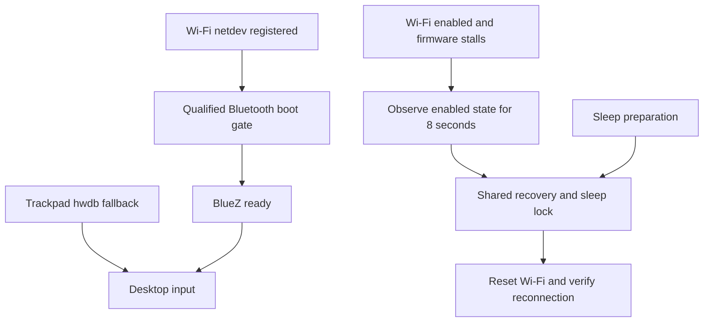

# Consolidated T2 support audit

This branch consolidates verified MacBookAir9,1 work. It does not claim hibernation support or validation on every T2 model. Automatic Bluetooth installer integration is now implemented; see [installer design and validation](t2-bluetooth-installer.md).

| Area | Included work | Evidence and limits |
| --- | --- | --- |
| Trackpad | `f4544c9c`, `14cb0600`: internal-device classification and defer fallback to systemd hwdb | Existing consolidated-branch commits preserved. Dedicated touchpad tests cover scope and upstream precedence. |
| Sleep/wake | `2b4d05d2`, `e2b87c3e`: BCM4377 Wi-Fi unload/reload and hardened failure handling | Existing consolidated-branch commits preserved. Recovery adds shared locking; hardware sleep validation of that added coordination remains pending. Hibernation is not established. |
| Wi-Fi saved-off recovery | `1f3d63b8`, `fbbdd7d6`: scoped firmware-stall watcher and eight-second enabled-state settlement | Stock linux-t2 saved-off boot passed September 10: boot `7472ed82-5e9a-46e8-a6f7-c6f4c819bde7`, enable 92.966 s, reset 103.481 s, NM connected 110.761 s, watcher RECOVERED 111.072 s. One attempt; user confirmed. Corrected in-session reproduction also passed. |
| Bluetooth startup/icon | Exact validated helper, unit, BlueZ ordering, blacklist and module list in `docs/t2-bluetooth-qualified/` | Normal startup, retained AirPods bonding/audio and Bluetooth off/on were user-confirmed in earlier testing. Current boot verifies helper 17.492 s, load returned 18.359 s, BlueZ started 18.412 s, sessions allowed 18.531 s. Automatic installer and migration integration now use the qualified readiness algorithm; see the installer document for transaction tests and remaining deployment validation. |

## Qualified Bluetooth baseline (historical integration boundary)

The following describes the original reference-only state. The installer now implements the preflight, adoption and rollback requirements below; `fix-t2.sh` also preserves an existing gate module list. See [current integration](t2-bluetooth-installer.md).

The qualified Bluetooth files are reference implementation assets, not an automatically executed installer. The helper is byte-identical to `/usr/local/sbin/bluetooth-after-wifi` on the verified machine (SHA-256 `65ca83f56e6638830405f0a29151637c90aa08c579de51a55d56b5f104ce35c3`). It deliberately retains the tested `MacBookAir9,1`, PCI `0000:73:00.0` and stock kernel `7.2.4-arch1-Watanare-T2-1-t2` guards. Broadening those guards is separate unvalidated work.

The live arrangement installs the helper at `/usr/local/sbin/bluetooth-after-wifi` (0755), the service under `/etc/systemd/system/`, the BlueZ drop-in at `/etc/systemd/system/bluetooth.service.d/50-t2-startup.conf`, and the two module configuration files under their respective `/etc/modules-load.d/` and `/etc/modprobe.d/` directories. `bluetooth-after-wifi.service` is enabled for multi-user.target. The early module list retains `t2bce_vhci` and removes the explicit early HCI request. The blacklist prevents modalias loading while explicit modprobe from the gate remains possible. The tested stock boot image did not contain the HCI module.

Do not blindly copy these files onto another installation. An installer must verify the model/kernel/PCI, inspect the boot image for early HCI loading, preserve administrator configuration with an owned rollback receipt, and handle the existing experimental service before enabling a replacement. It must not unload live Bluetooth, change radio preferences, or initiate reboot. The current `fix-t2.sh` still requests early HCI loading; enabling this reference arrangement automatically requires integrating that path as well. This gap is explicit rather than claiming that merging source alone deploys the Bluetooth behavior.

The earlier Bluetooth saved-off Wi-Fi failure is retained as a failure of the combined system before Wi-Fi recovery was corrected. The latest stock saved-off boot passes with both the qualified Bluetooth gate and corrected Wi-Fi watcher running. AirPods playback was not retested in that final boot.

## Current deployment acceptance

The consolidated Bluetooth installer has now been deployed and passed a fresh stock boot after the obsolete MPC kernel and override were retired. The saved-off Wi-Fi acceptance case also passed on stock. [Hardware validation and remaining limits](t2-validation.md). The historical reference-only limitations above are superseded by the implemented installer and this deployment result.

## Excluded experiments

The failed MPC driver policy, custom test kernel, candidate-kernel Bluetooth wrapper, raw firmware traces, hibernation experiments, and machine-specific resume configuration are not distribution fixes. They are not added to the consolidated installation path. The shipped Wi-Fi helper remains scoped to validated MacBookAir9,1 by default; other BCM4377 T2 models require explicit opt-in and separate evidence.

