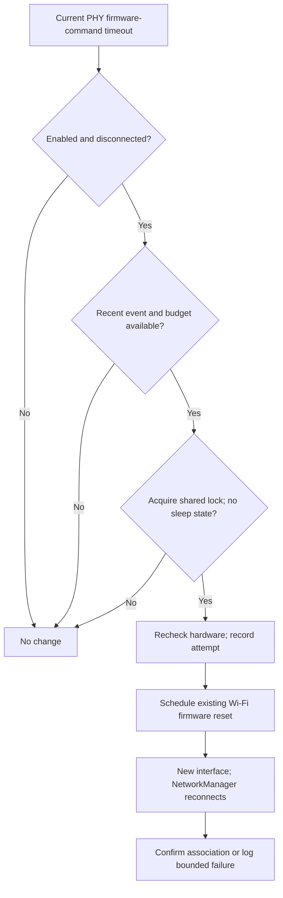

# T2 BCM4377 firmware-stall recovery

This patch adds automatic recovery for a BCM4377b firmware-command stall observed on MacBookAir9,1. Booting with Wi-Fi saved off can leave a registered interface whose first activation receives no firmware command completions. NetworkManager reports the radio enabled, but discovery and association fail. The recovery service schedules the driver's existing Wi-Fi firmware reset, and NetworkManager reconnects using the saved network. It does not replace the kernel, change MPC, force the radio on, or unload Bluetooth/T2 modules.

## Compatibility and evidence

Automatic setup is restricted to Apple MacBookAir9,1 with a T2 PCI controller (106b:1801 or 106b:1802) and exactly one BCM4377b adapter (14e4:4488). PCI addresses, PHY names and interface names are discovered rather than assumed. BCM4364 (14e4:4464) is excluded even with model opt-in. Other Apple T2 models with BCM4377b require `omarchy setup t2-wifi-recovery --allow-untested-model` for explicit validation. This opt-in does not bypass the T2/chip checks.

At runtime, the adapter must be bound to brcmfmac and expose its existing debugfs reset entry point. This replaces the prototype's exact kernel-release string allowlist with capability checks. The observed tests used Linux 7.2.4, BCM4377/4 firmware `16.20.371.0.3.6.125`, NetworkManager 1.58.1 and BlueZ 5.87. Capability checks do not constitute hardware validation on other kernels or models.

| Experiment on the validation host | Result |
| --- | --- |
| Boot with Wi-Fi disabled, then enable | Firmware query timeouts; no discovery |
| Driver policy intercepting named MPC writes and sending MPC=0 | Same failure; not included in this patch |
| Ordinary off/on after successful initialization, with 65 seconds off | Connected in about four seconds |
| Wi-Fi firmware reset while enabled | Fresh interface and connection in about six seconds |
| Fresh firmware reset while Wi-Fi off, then idle and enable | Reproduced the original timeout without rebooting |
| Explicit reset after that reproduced failure | Recovered in about six seconds without rebooting |
| Automatic recovery prototype | Two firmware-stall recoveries restored Wi-Fi without rebooting |
| User hardware check after automatic recovery | Wi-Fi, Bluetooth and audio all worked |

The first automatic recovery logged confirmed association about ten seconds after enable. Its observer initially stopped when the old interface disappeared, but the service independently confirmed success. A later run enabled Wi-Fi before the scripted 65-second wait finished; it supplies a second recovery observation, not a clean repetition of the complete timing protocol. That run exposed transient ENODEV while checking interface replacement. The corrected observer and service tolerate this transient, with fault-injection coverage.

The exact distribution integration, shared sleep lock, stock-kernel startup and other-model support are not yet hardware-validated. The known-good recovery prototype remains installed on the development host while this patch is reviewed. Do not present this as a firmware root-cause fix, hibernation fix, or validation of all T2 Macs.

## Trigger and bounded recovery

The daemon follows kernel journal entries from the current boot. Only the exact `brcmf_msgbuf_query_dcmd` response-timeout message for the current PHY is eligible. It ignores userspace messages, other PHYs, historical events, ordinary P2P errors, and a connected or disabled radio. It rechecks device identity, enabled state and connectivity immediately before scheduling reset.

A reset attempt is persisted before scheduling, with a maximum of three attempts per boot and a 120-second cooldown. Runtime state survives service restart, so restarting the service cannot erase this limit. After reset, success requires a replacement interface index, carrier up and NetworkManager reporting a connected device. The service verifies for at most 35 seconds, logs failure if recovery does not complete, and never forces Wi-Fi on if the user disables it. Events queued during the reset are discarded as triggers afterward.

## Sleep coordination

The recovery watcher retains its lock and stale sleep-state exclusion for compatibility with older installations. The Wi-Fi unload sleep helper has been withdrawn because of Bluetooth failures. The retirement migration disables its original installer-owned service; new installs no longer install it. The saved-off Wi-Fi recovery remains separate and is not a suspend fix.

## Installation, administrator policy and removal

The root hardware leaf enables the unit for the next boot on validated hardware. The migration and `omarchy setup t2-wifi-recovery` share that setup path and start it immediately on an existing supported installation. Unsupported hardware is skipped automatically. The service uses the packaged helper through `$OMARCHY_PATH` and a system unit; it does not install a standalone Python overlay.

Setup refuses an existing standalone `t2-wifi-recovery.service` rather than leaving two recovery daemons active. Remove the laboratory service with its own verified installer before enabling the packaged service. Setup also refuses a masked/symlinked unit, a unit differing from the supplied template, or a conflicting model opt-in drop-in. Other administrator drop-ins are preserved. Model opt-in persists in `10-model-opt-in.conf`.

Disable with `omarchy setup t2-wifi-recovery --disable`. This stops/disables only recovery, retaining configuration and the per-boot retry budget. Packaged files are removed through normal package management; there is no kernel or bootloader rollback for this change.

## Verification before broad distribution

1. Run the focused T2 recovery and sleep-retirement suites, metadata/CLI tests, and the repository aggregate suite.
2. On stock linux-t2, replace the laboratory service with the packaged service and verify startup, no duplicate watcher, and hardware eligibility.
3. On the next planned boot with Wi-Fi saved off, confirm the preference remains off; enable once and verify automatic discovery/association, service recovery logs, Bluetooth icon and audio. A forced reboot is not needed for further in-session development.
4. Verify ordinary off/on with no timeout does not trigger reset, disabling Wi-Fi is respected, and repeated failures stop at the recorded budget.
5. Resolve the Wi-Fi D3 failure and validate actual suspend with both radios; the former unload workaround is withdrawn. Do not test hibernate as part of this patch.
6. Obtain the same evidence from other T2/BCM4377 models before adding them to automatic setup. Record model, PCI IDs, firmware, kernel and driver-reset capability.

Use `journalctl -b -u omarchy-t2-wifi-recovery.service` and the corresponding current/failed boot kernel journal for review. Avoid collecting saved-network secrets or Bluetooth bonding keys. Local lab traces are not shipped in this patch.

## Historical patch validation record

The new recovery suite passed 27 Python tests plus shell integration cases for installation, explicit activation, model opt-in, conflicts, administrator overrides, migration, disable and the real sleep helper's lock refusal. The existing T2 sleep suite also passed, including private lock-file permissions. Bash syntax, Python compilation, CLI metadata/routing and systemd unit analysis passed. Systemd analysis used the checkout's Bash wrapper path because the new packaged command has not been installed on the host; it did not start the unit. The portable helper's read-only `--supported` and `--check` modes passed on the actual Mac and found its connected BCM4377 adapter.

The full `./test/all` run completed: CLI passed; 223 of 228 shell test files passed initially. The five failures were resolved with targeted reruns, without changing their source: `config-test.sh`, `unowned-system-paths-test.sh` and `snapper-test.sh` needed external packaging/installer checkouts; `launch-about-test.sh` needed inherited `NO_COLOR=1` removed; `network-qr-test.sh` needed its read-only route lookup outside the restricted socket sandbox. All five reruns passed. The external checkouts were `omacom/omarchy-pkgs` at `d5a2f30` and `omacom/omarchy-iso` at `a23f8d4`. There is no claim of a single uninterrupted green aggregate run in the original restricted environment.

## September 10 stock saved-off acceptance

The enabled-state settlement correction passed 31 focused Python tests and the shell integration suite. A stock in-session reproduction and a fresh saved-off stock boot both recovered automatically in about 18 seconds. The fresh boot was `7472ed82-5e9a-46e8-a6f7-c6f4c819bde7`, kernel `7.2.4-arch1-Watanare-T2-1-t2`; NetworkManager confirmed saved-off startup and activation, and the user confirmed restored Wi-Fi. One reset was used. The original firmware fault still occurs; this is a validated recovery workaround. Bluetooth service was active, but AirPods playback was not retested in that boot. The exact Bluetooth startup arrangement and remaining integration gaps are recorded in [the consolidated audit](t2-vintage-mac-support.md).
